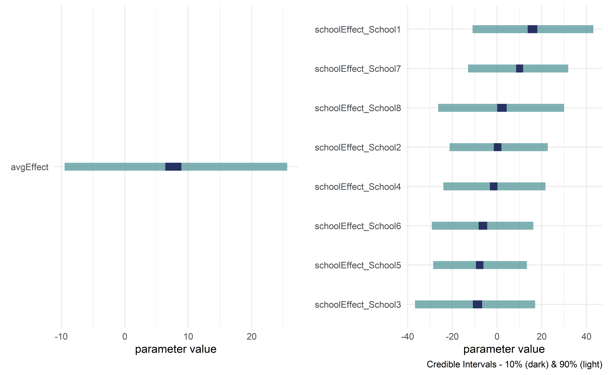
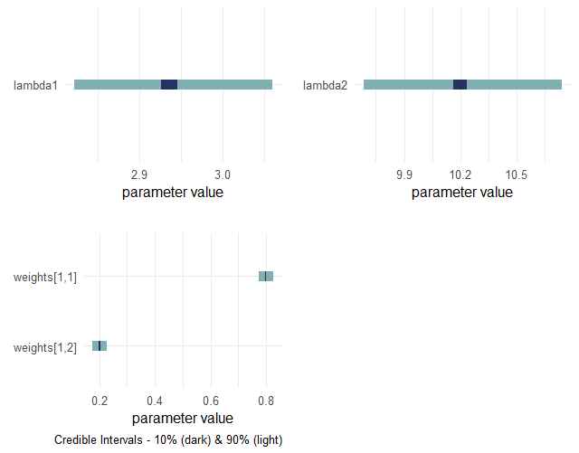

<!-- README.md is generated from README.Rmd. Please edit that file -->

```{r, echo=FALSE}
knitr::opts_chunk$set(
  collapse = TRUE,
  comment = "#>",
  fig.path = "man/figures/",
  dpi = 600,
  fig.asp = 0.618,
  fig.width = 6
)
```

<!-- badges: start -->
[](https://github.com/flyaflya/causact/actions)
[](https://cran.r-project.org/package=causact)
[](https://app.codecov.io/gh/flyaflya/causact?branch=master)
[](<Redirect-URL>)
<!-- badges: end -->

# causact

_Accelerate Bayesian analytics workflows_ in R through interactive modelling, visualization, and inference.  Uses probabilistic graphical models as a unifying language for business stakeholders, statisticians, and programmers.  

```{r demoGif, out.width = "40%", echo = FALSE, fig.align = "center"}
knitr::include_graphics("man/figures/causactDemo.gif")
```

This package relies on the sleek and elegant `greta` package for Bayesian inference. `greta`, in turn, is an interface into `TensorFlow` from R.  Future iterations of the `causact` package will aim to be a front-end into several universal probablistic programming languages (e.g. Stan, Turing, Gen, etc.). 

Using the `causact` package for Bayesian inference is featured in `A Business Analyst's Introduction to Business Analytics` available at https://www.causact.com/.

> Feedback and encouragement is appreciated via github issues or Twitter (https://twitter.com/preposterior).

## Installation

You can install the current release version of the package from CRAN:

```
install.packages("causact")
```

or the development version from GitHub:

```
install.packages("remotes")
remotes::install_github("flyaflya/causact")
```

`causact` requires the `greta` package for Bayesian updating, which in turn, requires a specific version of `TensorFlow`.  Install both `greta` and `TensorFlow` using the instructions available here: https://www.causact.com/install-tensorflow-greta-and-causact.html. 

## Usage 

Example taken from https://www.causact.com/graphical-models-tell-joint-distribution-stories.html#graphical-models-tell-joint-distribution-stories with the packages `dag_foo()` functions further described here:

https://www.causact.com/causact-quick-inference-with-generative-dags.html#causact-quick-inference-with-generative-dags


### Create beautiful model visualizations.

```{r defineGraph, results = "hide", echo = FALSE}
library(causact)
graph = dag_create() %>%
  dag_node(descr = "Get Card",label = "y",
           rhs = bernoulli(theta),
           data = carModelDF$getCard) %>%
  dag_node(descr = "Card Probability",label = "theta",
           rhs = beta(2,2),
           child = "y") %>%
  dag_plate(descr = "Car Model", label = "x",  
            data = carModelDF$carModel,  
            nodeLabels = "theta",  
            addDataNode = TRUE)
```

```{r cardP, eval = FALSE}
library(causact)
graph = dag_create() %>%
  dag_node(descr = "Get Card", label = "y",
           rhs = bernoulli(theta),
           data = carModelDF$getCard) %>%
  dag_node(descr = "Card Probability", label = "theta",
           rhs = beta(2,2),
           child = "y") %>%
  dag_plate(descr = "Car Model", label = "x",  
            data = carModelDF$carModel,  
            nodeLabels = "theta",  
            addDataNode = TRUE)  
graph %>% dag_render()
```

```{r cardPlatePlot, out.width = "60%", echo = FALSE}
knitr::include_graphics("man/figures/cardPlot.png")
```

### Hide model complexity, as appropriate, from domain experts and other less statistically minded stakeholders.

```{r cardPSL, eval = FALSE}
graph %>% dag_render(shortLabel = TRUE)
```

```{r cardPlateSLPlot, out.width = "50%", echo = FALSE}
knitr::include_graphics("man/figures/cardPlotShortLabel.png")
```

### See useful `greta` code without executing it (for debugging or learning)

```{r gretaCode, warning = FALSE, message = TRUE}
library(greta)
gretaCode = graph %>% dag_greta(mcmc = FALSE)
```

### Get posterior while automatically running the underlying `greta` code

```{r greta, warning = FALSE, message = FALSE}
library(greta)
drawsDF = graph %>% dag_greta()
drawsDF  ### see top of data frame
```

### Get quick view of posterior distribution

```{r gretaPost, fig.cap = "Credible interval plots.", fig.width = 6.5, fig.height = 4, out.width = "70%"}
drawsDF %>% dagp_plot()
```


## Getting Help and Suggesting Improvements

Whether you encounter a clear bug, have a suggestion for improvement, or just have a question, we are thrilled to help you out.  In all cases, please file a [GitHub issue](https://github.com/flyaflya/causact/issues).  If reporting a bug, please include a minimal reproducible example.  If encountering issues installing `greta`, please seek help at the [greta discussion forum](https://forum.greta-stats.org/).

## Contributing

We welcome help turning `causact` into the most intuitive and fastest method of converting stakeholder narratives about data-generating processes into actionable insight from posterior distributions.  If you want to help us achieve this vision, we welcome your contributions after reading the [new contributor guide](https://github.com/flyaflya/causact/blob/master/.github/contributing.md).  Please note that this project is released with a [Contributor Code of
Conduct](https://github.com/flyaflya/causact/blob/master/CODE_OF_CONDUCT.md). By participating in this project you agree to abide by its terms.

## Further Usage

For more info, see `A Business Analyst's Introduction to Business Analytics` available at https://www.causact.com.  You can also check out the package's vignette: `vignette("narrative-to-insight-with-causact")`.  Two additional examples are shown below.

## Prosocial Chimpanzees Example from Statistical Rethinking

> McElreath, Richard. Statistical rethinking: A Bayesian course with examples in R and Stan. Chapman and Hall/CRC, 2018.

```{r chimpsGraph, results ="hide", warning = FALSE, message = FALSE}
library(greta)
library(tidyverse)
library(causact)

# data object used below, chimpanzeesDF, is built-in to causact package

graph = dag_create() %>%
  dag_node("Pull Left Handle","L",
           rhs = bernoulli(p),
           data = causact::chimpanzeesDF$pulled_left) %>%
  dag_node("Probability of Pull", "p",
           rhs = ilogit(alpha + gamma + beta),
           child = "L") %>%
  dag_node("Actor Intercept","alpha",
           rhs = normal(alphaBar, sigma_alpha),
           child = "p") %>%
  dag_node("Block Intercept","gamma",
           rhs = normal(0,sigma_gamma),
           child = "p") %>%
  dag_node("Treatment Intercept","beta",
           rhs = normal(0,0.5),
           child = "p") %>%
  dag_node("Actor Population Intercept","alphaBar",
           rhs = normal(0,1.5),
           child = "alpha") %>%
  dag_node("Actor Variation","sigma_alpha",
           rhs = exponential(1),
           child = "alpha") %>%
  dag_node("Block Variation","sigma_gamma",
           rhs = exponential(1),
           child = "gamma") %>%
  dag_plate("Observation","i",
            nodeLabels = c("L","p")) %>%
  dag_plate("Actor","act",
            nodeLabels = c("alpha"),
            data = chimpanzeesDF$actor,
            addDataNode = TRUE) %>%
  dag_plate("Block","blk",
            nodeLabels = c("gamma"),
            data = chimpanzeesDF$block,
            addDataNode = TRUE) %>%
  dag_plate("Treatment","trtmt",
            nodeLabels = c("beta"),
            data = chimpanzeesDF$treatment,
            addDataNode = TRUE)
```

### See graph

```{r chimpsGraphRenderCode, eval = FALSE, warning = FALSE, message = FALSE}
graph %>% dag_render(width = 2000, height = 800)
```

```{r chimpsGraphRenderPlot, out.width = "120%", echo = FALSE}
knitr::include_graphics("man/figures/chimpStat.png")
```

### Communicate with stakeholders for whom the statistics might be distracting

```{r chimpsGraphRenderSL, eval = FALSE, warning = FALSE, message = FALSE}
graph %>% dag_render(shortLabel = TRUE)
```

```{r chimpsGraphRenderPlotSL, out.width = "100%", echo = FALSE}
knitr::include_graphics("man/figures/chimpStatSL.png")
```

### Compute posterior

```{r chimpsGraphGreta, warning = FALSE, message = FALSE}
drawsDF = graph %>% dag_greta()
```

### Visualize posterior

```{r chimpsGraphPost, out.width = "100%", fig.width = 9, fig.height = 6, warning = FALSE, message = FALSE}
drawsDF %>% dagp_plot()
```

## Eight Schools Example from Bayesian Data Analysis

> Gelman, Andrew, Hal S. Stern, John B. Carlin, David B. Dunson, Aki Vehtari, and Donald B. Rubin. Bayesian data analysis. Chapman and Hall/CRC, 2013.


```{r eightschoolsGraph, results ="hide", warning = FALSE, message = FALSE}
library(greta)
library(tidyverse)
library(causact)

# data object used below, schoolDF, is built-in to causact package

graph = dag_create() %>%
  dag_node("Treatment Effect","y",
           rhs = normal(theta, sigma),
           data = causact::schoolsDF$y) %>%
  dag_node("Std Error of Effect Estimates","sigma",
           data = causact::schoolsDF$sigma,
           child = "y") %>%
  dag_node("Exp. Treatment Effect","theta",
           child = "y",
           rhs = avgEffect + schoolEffect) %>%
  dag_node("Pop Treatment Effect","avgEffect",
           child = "theta",
           rhs = normal(0,30)) %>%
  dag_node("School Level Effects","schoolEffect",
           rhs = normal(0,30),
           child = "theta") %>%
  dag_plate("Observation","i",nodeLabels = c("sigma","y","theta")) %>%
  dag_plate("School Name","school",
            nodeLabels = "schoolEffect",
            data = causact::schoolsDF$schoolName,
            addDataNode = TRUE)
```

### See graph

```{r eightschoolsGraphRenderCode, eval = FALSE, warning = FALSE, message = FALSE}
graph %>% dag_render()
```

```{r eightschoolsGraphRenderPlot, out.width = "100%", echo = FALSE}
knitr::include_graphics("man/figures/eightSchoolStat.png")
```

### Compute posterior

```{r eightschoolsGraphGreta, warning = FALSE, message = FALSE}
drawsDF = graph %>% dag_greta()
```

### Visualize posterior

```{r eightschoolsGraphPost, out.width = "100%", eval = FALSE, fig.width = 9, fig.height = 6, warning = FALSE, message = FALSE}
drawsDF %>% dagp_plot()
```

```{r eightschoolsGraphRenderPost, out.width = "100%", echo = FALSE}

```

## Example Where Observed RV Is A Mixed RV

```{r mixtureGraph, results ="hide", warning = FALSE, message = FALSE}
#### use dirichlet instead
library(greta)
library(tidyverse)
library(causact)

## sample data - try to recover params
x <- c(rpois(800, 3),rpois(200, 10))

graph = dag_create() %>%  ## create generative DAG
  dag_node("Mixed Var","x",
           rhs = mixture(alpha,beta,
                         weights = t(weights)),
           data = x) %>%
  dag_node("Count Var 1","alpha",
           rhs = poisson(lambda1),
           child = "x") %>%
  dag_node("Count Var 2","beta",
           rhs = poisson(lambda2),
           child = "x") %>%
  dag_node("Weight Vars","weights",
           rhs = dirichlet(t(c(1,1))),
           child = "x") %>%
  dag_node("Exp Rate 1","lambda1",
           rhs = uniform(1,5),
           child = "alpha") %>%
  dag_node("Exp Rate 2","lambda2",
           rhs = uniform(6,20),
           child = "beta")
```

### See graph

```{r mixtureGraphRenderCode, eval = FALSE, warning = FALSE, message = FALSE}
graph %>% dag_render()
```

```{r mixtureGraphRenderPlot, out.width = "100%", echo = FALSE}
knitr::include_graphics("man/figures/mixture.png")
```

### Compute posterior

```{r mixtureGraphHidden, results ="hide", warning = FALSE, message = FALSE, echo = FALSE}
## put data right into graph... otherwise build_readme() gives error due to x being in a different environment
graph = dag_create() %>%  ## create generative DAG
  dag_node("Mixed Var","x",
           rhs = mixture(alpha,beta,
                         weights = t(weights)),
           data = c(rpois(800, 3),rpois(200, 10))) %>%
  dag_node("Count Var 1","alpha",
           rhs = poisson(lambda1),
           child = "x") %>%
  dag_node("Count Var 2","beta",
           rhs = poisson(lambda2),
           child = "x") %>%
  dag_node("Weight Vars","weights",
           rhs = dirichlet(t(c(1,1))),
           child = "x") %>%
  dag_node("Exp Rate 1","lambda1",
           rhs = uniform(1,5),
           child = "alpha") %>%
  dag_node("Exp Rate 2","lambda2",
           rhs = uniform(6,20),
           child = "beta")
```

```{r mixtureGraphGreta, warning = FALSE, message = FALSE, echo=-1}
drawsDF = graph %>% dag_greta()
```

### Visualize posterior

```{r mixtureGraphPost, out.width = "100%", eval = FALSE, fig.width = 9, fig.height = 6, warning = FALSE, message = FALSE}
drawsDF %>% dagp_plot()
```

```{r mixtureGraphRenderPost, out.width = "100%", echo = FALSE}

```
