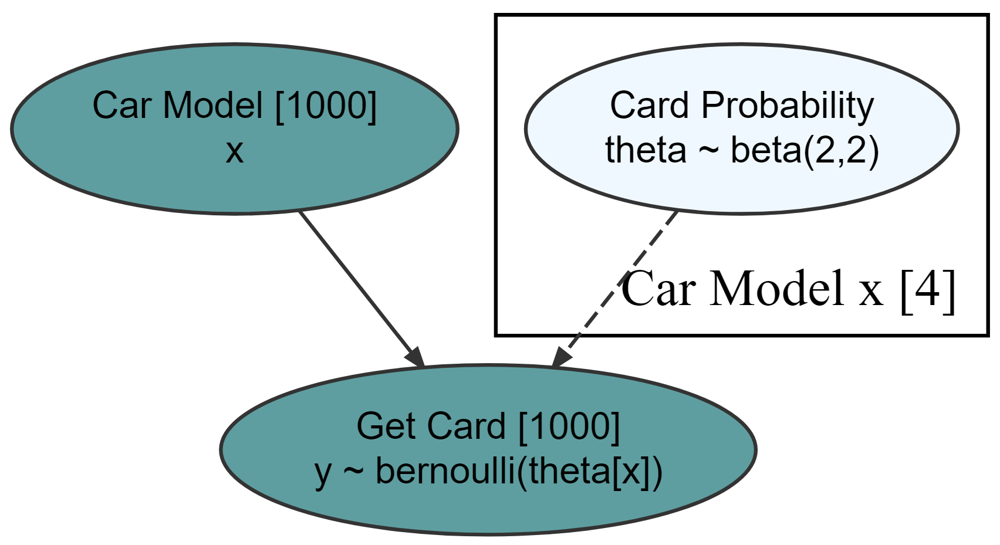
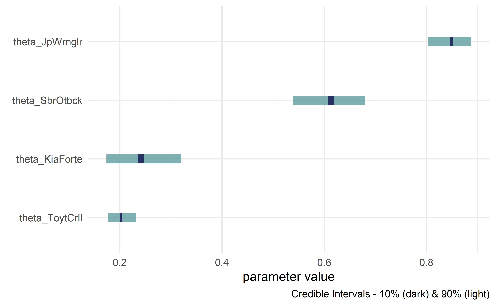
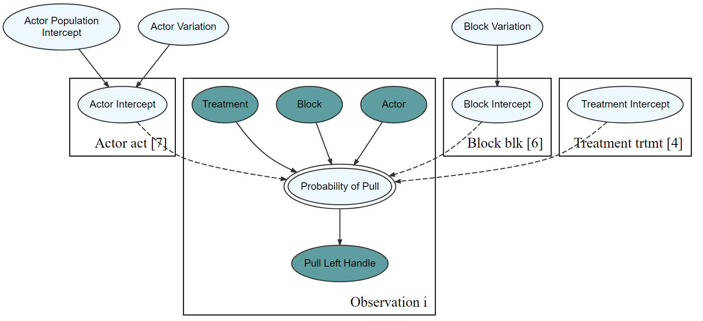
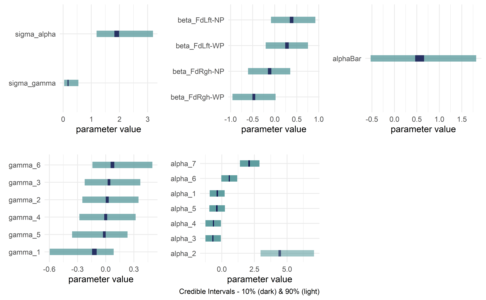
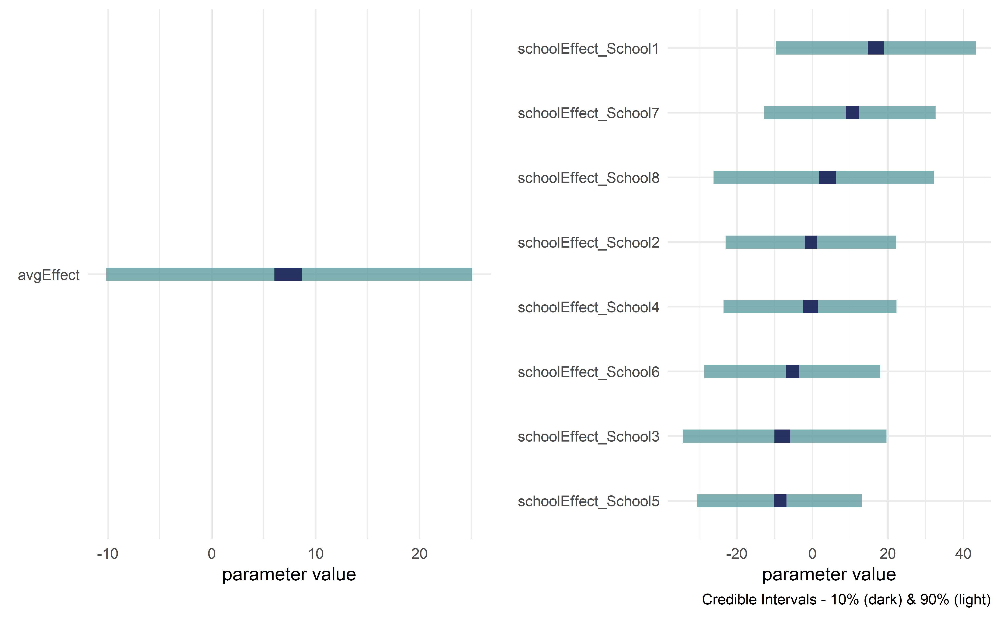

<!-- README.md is generated from README.Rmd. Please edit that file -->

# causact

*Accelerate Bayesian analytics workflows* in R through interactive
modelling, visualization, and inference. Uses probabilistic graphical
models as a unifying language for business stakeholders, statisticians,
and programmers.


This package relies on the sleek and elegant `greta` package for
Bayesian inference. `greta`, in turn, is an interface into tensorflow
from R. Future iterations of the `causact` package will aim to be a
front-end into several universal probablistic programming languages
(e.g. Stan, Turing, Gen, etc.).

Using the `causact` package for Bayesian inference is featured in `A
Business Analyst's Introduction to Business Analytics` available at
<http://causact.com/>.

> NOTE: Package is very “alpha” and under active development. Breaking
> changes are to be expected. Feedback and encouragement is appreciated
> via github issues or Twitter (<https://twitter.com/preposterior>).

## Installation

    install.packages("remotes")
    remotes::install_github("flyaflya/causact")

`causact` requires the `greta` package for Bayesian updating. Install
`greta` using the instructions available here:
<https://www.causact.com/install-tensorflow-and-greta.html#install-tensorflow-and-greta>

## Usage

Example taken from <https://www.causact.com/causact-quick-inference-with-generative-dags.html#the-credit-card-example-revisited>
 using the pacakges `dag_foo()` functions:


### Create beautiful model visualizations.

``` r
library(causact)
graph = dag_create() %>%
  dag_node(descr = "Get Card", label = "y",
           rhs = bernoulli(theta),
           data = carModelDF$getCard) %>%
  dag_node(descr = "Card Probability", label = "theta",
           rhs = beta(2,2),
           child = "y") %>%
  dag_plate(descr = "Car Model", label = "x",  
            data = carModelDF$carModel,  
            nodeLabels = "theta",  
            addDataNode = TRUE)  
graph %>% dag_render()
```



### Hide model complexity, as appropriate, from domain experts and other less statistically minded stakeholders.

``` r
graph %>% dag_render(shortLabel = TRUE)
```


### Run statistical inference using `greta`

``` r
library(greta)
graph %>% dag_greta(mcmc = TRUE)
#> ## The specified DAG corresponds to the following greta code: 
#> y <- as_data(carModelDF$getCard)   #DATA
#> x      <- as.factor(carModelDF$carModel)   #DIM
#> x_dim  <- length(unique(x))   #DIM
#> theta  <- beta(shape1 = 2, shape2 = 2, dim = x_dim)   #PRIOR
#> distribution(y) <- bernoulli(prob = theta[x])   #LIKELIHOOD
#> gretaModel <- model(theta)   #MODEL
#> draws       <- mcmc(gretaModel)   #POSTERIOR
#> draws       <- replaceLabels(draws)   #POSTERIOR
#> drawsDF     <- draws %>% as.matrix() %>% dplyr::as_tibble()   #POSTERIOR
#> tidyDrawsDF <- drawsDF %>% tidyr::gather() %>%
#>     addPriorGroups()   #POSTERIOR
```

### Get quick view of posterior distribution

``` r
tidyDrawsDF %>% dagp_plot()
```



## Further Usage

For more info, see `The Business Analyst's Guide to Business Analytics`
available at <http://causact.com/>. Two additional examples shown
below.

## Prosocial Chimpanzees Example from Statistical Rethinking

> McElreath, Richard. Statistical rethinking: A Bayesian course with
> examples in R and Stan. Chapman and Hall/CRC, 2018.

``` r
library(rethinking)
library(greta)
library(tidyverse)
library(causact)

data("chimpanzees")
chimpanzeesDF = chimpanzees %>%
  mutate(treatment = dplyr::case_when(
    prosoc_left == 0 & condition == 0 ~"Food Right - No Partner",
    prosoc_left == 1 & condition == 0 ~"Food Left - No Partner",
    prosoc_left == 0 & condition == 1 ~"Food Right - With Partner",
    prosoc_left == 1 & condition == 1 ~"Food Left - With Partner",
    TRUE ~ "Unknown"))

graph = dag_create() %>%
  dag_node("Pull Left Handle","L",
           rhs = bernoulli(p),
           data = chimpanzeesDF$pulled_left) %>%
  dag_node("Probability of Pull", "p",
           rhs = ilogit(alpha + gamma + beta),
           child = "L") %>%
  dag_node("Actor Intercept","alpha",
           rhs = normal(alphaBar, sigma_alpha),
           child = "p") %>%
  dag_node("Block Intercept","gamma",
           rhs = normal(0,sigma_gamma),
           child = "p") %>%
  dag_node("Treatment Intercept","beta",
           rhs = normal(0,0.5),
           child = "p") %>%
  dag_node("Actor Population Intercept","alphaBar",
           rhs = normal(0,1.5),
           child = "alpha") %>%
  dag_node("Actor Variation","sigma_alpha",
           rhs = exponential(1),
           child = "alpha") %>%
  dag_node("Block Variation","sigma_gamma",
           rhs = exponential(1),
           child = "gamma") %>%
  dag_plate("Observation","i",
            nodeLabels = c("L","p")) %>%
  dag_plate("Actor","act",
            nodeLabels = c("alpha"),
            data = chimpanzeesDF$actor,
            addDataNode = TRUE) %>%
  dag_plate("Block","blk",
            nodeLabels = c("gamma"),
            data = chimpanzeesDF$block,
            addDataNode = TRUE) %>%
  dag_plate("Treatment","trtmt",
            nodeLabels = c("beta"),
            data = chimpanzeesDF$treatment,
            addDataNode = TRUE)
```

### See graph

``` r
graph %>% dag_render(width = 2000, height = 800)
```


### See graph without stats

``` r
graph %>% dag_render(shortLabel = TRUE)
```



### Compute posterior

``` r
graph %>% dag_greta(mcmc = TRUE)
#> ## The specified DAG corresponds to the following greta code: 
#> L <- as_data(chimpanzeesDF$pulled_left)   #DATA
#> act       <- as.factor(chimpanzeesDF$actor)   #DIM
#> blk       <- as.factor(chimpanzeesDF$block)   #DIM
#> trtmt     <- as.factor(chimpanzeesDF$treatment)   #DIM
#> act_dim   <- length(unique(act))   #DIM
#> blk_dim   <- length(unique(blk))   #DIM
#> trtmt_dim <- length(unique(trtmt))   #DIM
#> beta        <- normal(mean = 0, sd = 0.5, dim = trtmt_dim)                #PRIOR
#> sigma_gamma <- exponential(rate = 1)                                      #PRIOR
#> sigma_alpha <- exponential(rate = 1)                                      #PRIOR
#> alphaBar    <- normal(mean = 0, sd = 1.5)                                 #PRIOR
#> gamma       <- normal(mean = 0, sd = sigma_gamma, dim = blk_dim)          #PRIOR
#> alpha       <- normal(mean = alphaBar, sd = sigma_alpha, dim = act_dim)   #PRIOR
#> p      <- ilogit(x = alpha[act] + gamma[blk] + beta[trtmt])   #OPERATION
#> distribution(L) <- bernoulli(prob = p)   #LIKELIHOOD
#> gretaModel <- model(alpha,gamma,beta,alphaBar,sigma_alpha,sigma_gamma)   #MODEL
#> draws       <- mcmc(gretaModel)   #POSTERIOR
#> draws       <- replaceLabels(draws)   #POSTERIOR
#> drawsDF     <- draws %>% as.matrix() %>% dplyr::as_tibble()   #POSTERIOR
#> tidyDrawsDF <- drawsDF %>% tidyr::gather() %>%
#>     addPriorGroups()   #POSTERIOR
```

### Visualize posterior

``` r
tidyDrawsDF %>% dagp_plot()
```



## Eight Schools Example from Bayesian Data Analysis

> Gelman, Andrew, Hal S. Stern, John B. Carlin, David B. Dunson, Aki
> Vehtari, and Donald B. Rubin. Bayesian data analysis. Chapman and
> Hall/CRC, 2013.

``` r
library(greta)
library(tidyverse)
library(causact)

schools_dat <- data.frame(y = c(28,  8, -3,  7, -1,  1, 18, 12),
                          sigma = c(15, 10, 16, 11,  9, 11, 10, 18), schoolName = paste0("School",1:8))

graph = dag_create() %>%
  dag_node("Treatment Effect","y",
           rhs = normal(theta, sigma),
           data = schools_dat$y) %>%
  dag_node("Std Error of Effect Estimates","sigma",
           data = schools_dat$sigma,
           child = "y") %>%
  dag_node("Exp. Treatment Effect","theta",
           child = "y",
           rhs = avgEffect + schoolEffect) %>%
  dag_node("Pop Treatment Effect","avgEffect",
           child = "theta",
           rhs = normal(0,30)) %>%
  dag_node("School Level Effects","schoolEffect",
           rhs = normal(0,30),
           child = "theta") %>%
  dag_plate("Observation","i",nodeLabels = c("sigma","y","theta")) %>%
  dag_plate("School Name","school",
            nodeLabels = "schoolEffect",
            data = schools_dat$schoolName,
            addDataNode = TRUE)
```

### See graph

``` r
graph %>% dag_render()
```


### Compute posterior

``` r
graph %>% dag_greta(mcmc = TRUE)
#> ## The specified DAG corresponds to the following greta code: 
#> sigma <- as_data(schools_dat$sigma)   #DATA
#> y <- as_data(schools_dat$y)           #DATA
#> school     <- as.factor(schools_dat$schoolName)   #DIM
#> school_dim <- length(unique(school))   #DIM
#> schoolEffect <- normal(mean = 0, sd = 30, dim = school_dim)   #PRIOR
#> avgEffect    <- normal(mean = 0, sd = 30)                     #PRIOR
#> theta  <- avgEffect + schoolEffect[school]   #OPERATION
#> distribution(y) <- normal(mean = theta, sd = sigma)   #LIKELIHOOD
#> gretaModel <- model(avgEffect,schoolEffect)   #MODEL
#> draws       <- mcmc(gretaModel)   #POSTERIOR
#> draws       <- replaceLabels(draws)   #POSTERIOR
#> drawsDF     <- draws %>% as.matrix() %>% dplyr::as_tibble()   #POSTERIOR
#> tidyDrawsDF <- drawsDF %>% tidyr::gather() %>%
#>     addPriorGroups()   #POSTERIOR
```

### Visualize posterior

``` r
tidyDrawsDF %>% dagp_plot()
```


