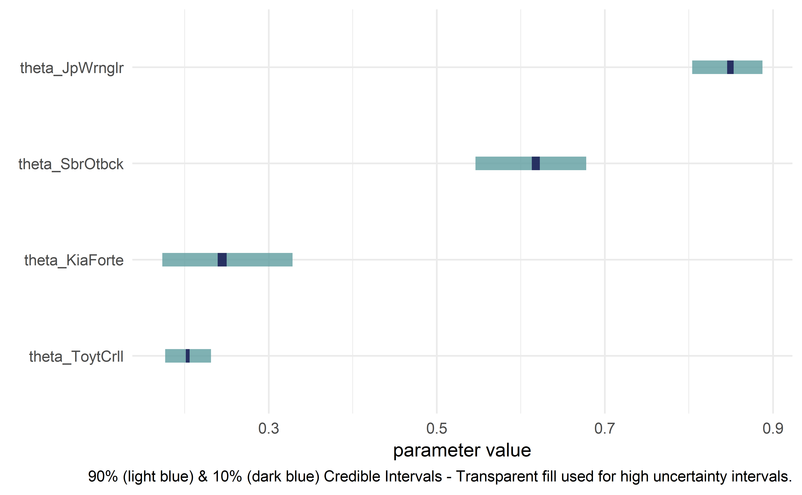

<!-- README.md is generated from README.Rmd. Please edit that file -->

# causact

*Accelerate Bayesian analytics workflows* in R through interactive
modelling, visualization, and inference. Uses probabilistic graphical
models as a unifying language for business stakeholders, statisticians,
and programmers.

Future goals are two-fold:

1.  For *mathy* people to label this the easiest front-end language into
    universal probablistic programming, and
2.  for *all* people to compel change using data-driven insight
    generated with assistance from this package.

Using the `causact` package for Bayesian inference is featured in `The
Business Analyst's Guide to Business Analytics` available at
<http://causact.updog.co/>.

## Installation

    install.packages("remotes")
    remotes::install_github("flyaflya/causact")

`causact` relies on the very sleek and elegant `greta` package for
Bayesain updating. `greta` provides a simple interface to Tensorflow
from R. Install `greta` using the instructions avaliable here:
<http://causact.updog.co/install-greta.html>

## Usage

Example from <http://causact.updog.co/graphical-models.html> with
`dag_foo()` functions described here:

<http://causact.updog.co/using-causact-dags-for-inference.html>

### Create beautiful model visualizations.

``` r
library(causact)
graph = dag_create() %>%
  dag_node("Get Card","y",
           rhs = bernoulli(theta),
           data = carModelDF$getCard) %>%
  dag_node(descr = "Card Probability",label = "theta",
           rhs = beta(2,2),
           child = "y") %>%
  dag_plate(descr = "Car Model", label = "x",  
            data = carModelDF$carModel,  
            nodeLabels = "theta",  
            addDataNode = TRUE)  
graph %>% dag_render()
```


### Hide model complexity, as appropriate, from domain experts and other less statistically minded stakeholders.

``` r
graph %>% dag_render(shortLabel = TRUE)
```


### Run statistical inference using `greta`

``` r
library(greta)
graph %>% dag_greta(mcmc = TRUE)
#> ## The specified DAG corresponds to the following greta code: 
#> y <- as_data(carModelDF$getCard)   #DATA
#> x      <- as.factor(carModelDF$carModel)   #DIM
#> x_dim  <- length(unique(x))   #DIM
#> theta  <- beta(shape1 = 2, shape2 = 2, dim = x_dim)   #PRIOR
#> distribution(y) <- bernoulli(prob = theta[x])   #LIKELIHOOD
#> gretaModel <- model(theta)   #MODEL
#> draws       <- mcmc(gretaModel)   #POSTERIOR
#> draws       <- replaceLabels(draws)   #POSTERIOR
#> drawsDF     <- draws %>% as.matrix() %>% dplyr::as_tibble()   #POSTERIOR
#> tidyDrawsDF <- drawsDF %>% tidyr::gather() %>%
#>     addPriorGroups()   #POSTERIOR
```

### Get quick view of posterior distribution

``` r
tidyDrawsDF %>% dagp_plot()
```



## Further Usage

For more info, see `The Business Analyst's Guide to Business Analytics`
available at <http://causact.updog.co/>.
