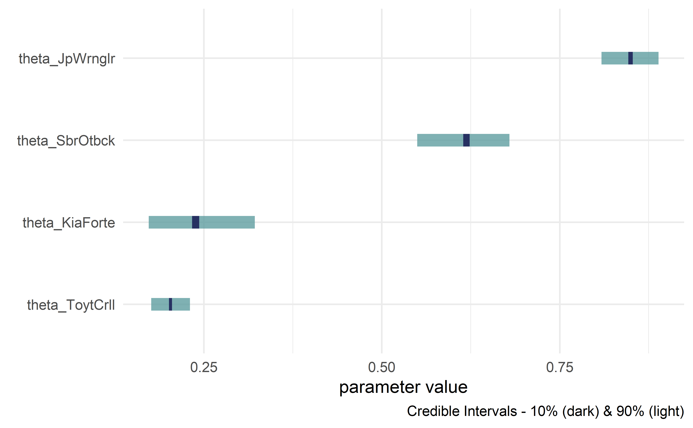
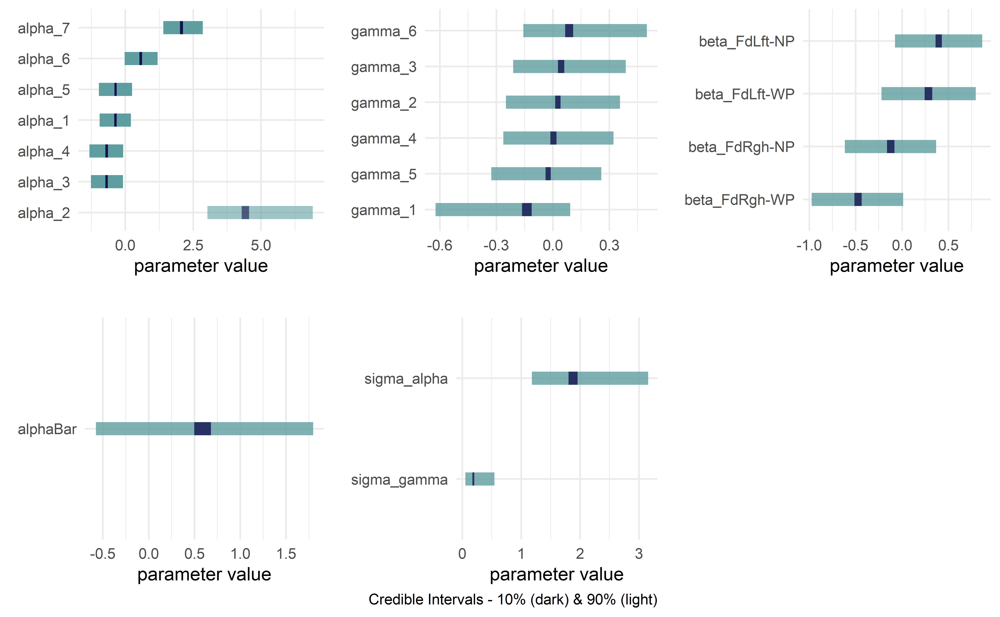

<!-- README.md is generated from README.Rmd. Please edit that file -->

# causact

*Accelerate Bayesian analytics workflows* in R through interactive
modelling, visualization, and inference. Uses probabilistic graphical
models as a unifying language for business stakeholders, statisticians,
and programmers.


This package relies on the sleek and elegant `greta` package for
Bayesian inference. `greta`, in turn, is an interface into `TensorFlow`
from R. Future iterations of the `causact` package will aim to be a
front-end into several universal probablistic programming languages
(e.g. Stan, Turing, Gen, etc.).

Using the `causact` package for Bayesian inference is featured in `The
Business Analyst's Guide to Business Analytics` available at
<http://causact.com/>.

> NOTE: Package is under active development. Breaking changes are to be
> expected. Feedback and encouragement is appreciated via github issues
> or Twitter (<https://twitter.com/preposterior>).

## Installation

You can install the current release version of the package from CRAN:

    install.packages("causact")

or the development version from GitHub:

    install.packages("remotes")
    remotes::install_github("flyaflya/causact")

`causact` requires the `greta` package for Bayesian updating, which in
turn, requires a specific version of `TensorFlow`. Install both `greta`
and `TensorFlow` using the instructions available here:
<https://www.causact.com/install-tensorflow-greta-and-causact.html>

## Usage

Example taken from
<https://www.causact.com/graphical-models-tell-joint-distribution-stories.html#graphical-models-tell-joint-distribution-stories>
with the packages `dag_foo()` functions further described here:

<https://www.causact.com/causact-quick-inference-with-generative-dags.html#causact-quick-inference-with-generative-dags>

### Create beautiful model visualizations.

``` r
library(causact)
graph = dag_create() %>%
  dag_node(descr = "Get Card", label = "y",
           rhs = bernoulli(theta),
           data = carModelDF$getCard) %>%
  dag_node(descr = "Card Probability", label = "theta",
           rhs = beta(2,2),
           child = "y") %>%
  dag_plate(descr = "Car Model", label = "x",  
            data = carModelDF$carModel,  
            nodeLabels = "theta",  
            addDataNode = TRUE)  
graph %>% dag_render()
```


### Hide model complexity, as appropriate, from domain experts and other less statistically minded stakeholders.

``` r
graph %>% dag_render(shortLabel = TRUE)
```


### See useful `greta` code without executing it (for debugging or learning)

``` r
library(greta)
#> 
#> Attaching package: 'greta'
#> The following objects are masked from 'package:stats':
#> 
#>     binomial, cov2cor, poisson
#> The following objects are masked from 'package:base':
#> 
#>     %*%, apply, backsolve, beta, chol2inv, colMeans, colSums, diag,
#>     eigen, forwardsolve, gamma, identity, rowMeans, rowSums, sweep,
#>     tapply
gretaCode = graph %>% dag_greta(mcmc = FALSE)
#> ## The below greta code will return a posterior distribution 
#> ## for the given DAG. Either copy and paste this code to use greta
#> ## directly, evaluate the output object using 'eval', or 
#> ## or (preferably) use dag_greta(mcmc=TRUE) to return a data frame of
#> ## the posterior distribution: 
#> y <- as_data(carModelDF$getCard)   #DATA
#> x      <- as.factor(carModelDF$carModel)   #DIM
#> x_dim  <- length(unique(x))   #DIM
#> theta  <- beta(shape1 = 2, shape2 = 2, dim = x_dim)   #PRIOR
#> distribution(y) <- bernoulli(prob = theta[x])   #LIKELIHOOD
#> gretaModel  <- model(theta)   #MODEL
#> meaningfulLabels(graph)
#> draws       <- mcmc(gretaModel)              #POSTERIOR
#> drawsDF     <- replaceLabels(draws) %>% as.matrix() %>%
#>                 dplyr::as_tibble()           #POSTERIOR
#> tidyDrawsDF <- drawsDF %>% addPriorGroups()  #POSTERIOR
```

### Get posterior while automatically running the underlying `greta` code

``` r
library(greta)
drawsDF = graph %>% dag_greta()
drawsDF  ### see top of data frame
#> # A tibble: 4,000 x 4
#>    theta_JpWrnglr theta_KiaForte theta_SbrOtbck theta_ToytCrll
#>             <dbl>          <dbl>          <dbl>          <dbl>
#>  1          0.833          0.235          0.634          0.226
#>  2          0.815          0.239          0.680          0.193
#>  3          0.815          0.239          0.680          0.193
#>  4          0.839          0.266          0.689          0.175
#>  5          0.804          0.178          0.615          0.186
#>  6          0.844          0.338          0.595          0.219
#>  7          0.837          0.212          0.598          0.219
#>  8          0.837          0.212          0.598          0.219
#>  9          0.866          0.197          0.657          0.202
#> 10          0.829          0.278          0.638          0.181
#> # ... with 3,990 more rows
```

### Get quick view of posterior distribution

``` r
drawsDF %>% dagp_plot()
```

<div class="figure">



<p class="caption">

Credible interval plots.

</p>

</div>

## Further Usage

For more info, see `The Business Analyst's Guide to Business Analytics`
available at <https://www.causact.com>. Two additional examples are
shown below.

## Prosocial Chimpanzees Example from Statistical Rethinking

> McElreath, Richard. Statistical rethinking: A Bayesian course with
> examples in R and Stan. Chapman and Hall/CRC, 2018.

``` r
library(greta)
library(tidyverse)
library(causact)

# data object used below, chimpanzeesDF, is built-in to causact package

graph = dag_create() %>%
  dag_node("Pull Left Handle","L",
           rhs = bernoulli(p),
           data = causact::chimpanzeesDF$pulled_left) %>%
  dag_node("Probability of Pull", "p",
           rhs = ilogit(alpha + gamma + beta),
           child = "L") %>%
  dag_node("Actor Intercept","alpha",
           rhs = normal(alphaBar, sigma_alpha),
           child = "p") %>%
  dag_node("Block Intercept","gamma",
           rhs = normal(0,sigma_gamma),
           child = "p") %>%
  dag_node("Treatment Intercept","beta",
           rhs = normal(0,0.5),
           child = "p") %>%
  dag_node("Actor Population Intercept","alphaBar",
           rhs = normal(0,1.5),
           child = "alpha") %>%
  dag_node("Actor Variation","sigma_alpha",
           rhs = exponential(1),
           child = "alpha") %>%
  dag_node("Block Variation","sigma_gamma",
           rhs = exponential(1),
           child = "gamma") %>%
  dag_plate("Observation","i",
            nodeLabels = c("L","p")) %>%
  dag_plate("Actor","act",
            nodeLabels = c("alpha"),
            data = chimpanzeesDF$actor,
            addDataNode = TRUE) %>%
  dag_plate("Block","blk",
            nodeLabels = c("gamma"),
            data = chimpanzeesDF$block,
            addDataNode = TRUE) %>%
  dag_plate("Treatment","trtmt",
            nodeLabels = c("beta"),
            data = chimpanzeesDF$treatment,
            addDataNode = TRUE)
```

### See graph

``` r
graph %>% dag_render(width = 2000, height = 800)
```


### Communicate with stakeholders for whom the statistics might be distracting

``` r
graph %>% dag_render(shortLabel = TRUE)
```


### Compute posterior

``` r
drawsDF = graph %>% dag_greta()
```

### Visualize posterior

``` r
drawsDF %>% dagp_plot()
```



## Eight Schools Example from Bayesian Data Analysis

> Gelman, Andrew, Hal S. Stern, John B. Carlin, David B. Dunson, Aki
> Vehtari, and Donald B. Rubin. Bayesian data analysis. Chapman and
> Hall/CRC, 2013.

``` r
library(greta)
library(tidyverse)
library(causact)

# data object used below, schoolDF, is built-in to causact package

graph = dag_create() %>%
  dag_node("Treatment Effect","y",
           rhs = normal(theta, sigma),
           data = causact::schoolsDF$y) %>%
  dag_node("Std Error of Effect Estimates","sigma",
           data = causact::schoolsDF$sigma,
           child = "y") %>%
  dag_node("Exp. Treatment Effect","theta",
           child = "y",
           rhs = avgEffect + schoolEffect) %>%
  dag_node("Pop Treatment Effect","avgEffect",
           child = "theta",
           rhs = normal(0,30)) %>%
  dag_node("School Level Effects","schoolEffect",
           rhs = normal(0,30),
           child = "theta") %>%
  dag_plate("Observation","i",nodeLabels = c("sigma","y","theta")) %>%
  dag_plate("School Name","school",
            nodeLabels = "schoolEffect",
            data = causact::schoolsDF$schoolName,
            addDataNode = TRUE)
```

### See graph

``` r
graph %>% dag_render()
```


### Compute posterior

``` r
drawsDF = graph %>% dag_greta()
```

### Visualize posterior

``` r
drawsDF %>% dagp_plot()
```


