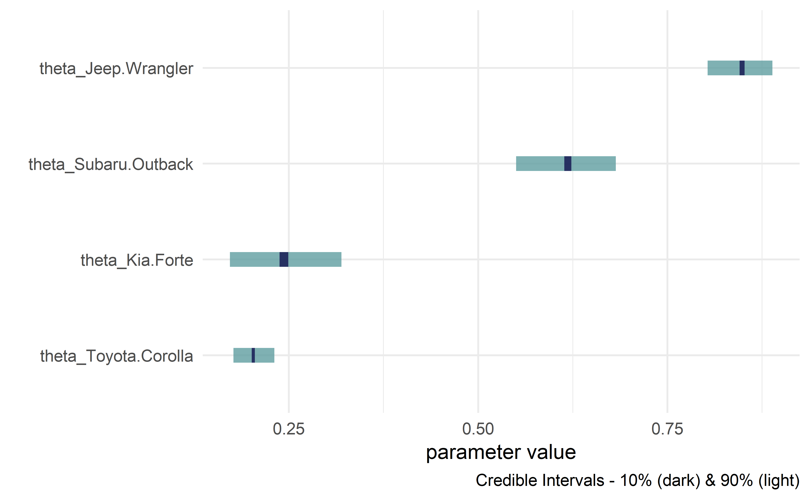

<!-- README.md is generated from README.Rmd. Please edit that file -->
<!-- badges: start -->

[](https://github.com/flyaflya/causact/actions)
[](https://cran.r-project.org/package=causact)
[](https://app.codecov.io/gh/flyaflya/causact?branch=master)
[](https://img.shields.io/badge/Lifecycle-Maturing-007EC6)
[](https://doi.org/10.5281/zenodo.6949489)
[](https://doi.org/10.21105/joss.04415)
<!-- badges: end -->

# causact

*Accelerate Bayesian analytics workflows* in R through interactive
modelling, visualization, and inference. Uses probabilistic graphical
models as a unifying language for business stakeholders, statisticians,
and programmers. Due to its visual nature and simple model construction,
`causact` serves as a great entry-point for newcomers to computational
Bayesian inference.


This package is solely R-based, but behind the scenes, it relies on the
`numpyro` Python package for Bayesian inference.

Using the `causact` package for Bayesian inference is featured in
`A Business Analyst's Introduction to Business Analytics` available at
<https://www.causact.com/>.

> Feedback and encouragement is appreciated via github issues or Twitter
> (<https://twitter.com/preposterior>).

## Installation

You can install the current release version of the package from CRAN:

    install.packages("causact")

or the development version from GitHub:

    install.packages("remotes")
    remotes::install_github("flyaflya/causact")

While `causact` can be used for DAG visualization, getting Bayesian
posteriors requires the `numpyro` package, which in turn, requires
python and some other dependencies. Install `numpyro` and other python
dependencies by running the following after installing `causact`:

    library(causact)
    install_causact_deps()

Please answer `Y` to any prompts for installing miniconda if needed.

If you need to access an older version where the `dag_greta()` function
is still operational, install `v0.4.2` of the `causact` package (this is
NOT recommended):

    ### DO NOT RUN THESE LINES UNLESS YOU NEED
    ### dag_greta() for your previous code to work
    install.packages("remotes")
    remotes::install_github("flyaflya/causact@0.4.2")

## Usage

Example taken from
<https://www.causact.com/graphical-models-tell-joint-distribution-stories.html#graphical-models-tell-joint-distribution-stories>
with the packages `dag_foo()` functions further described here:

<https://www.causact.com/causact-quick-inference-with-generative-dags.html#causact-quick-inference-with-generative-dags>

### Create beautiful model visualizations.

    #> Initializing python, numpyro, and other dependencies. This may take up to 15 seconds...
    #> Initializing python, numpyro, and other dependencies. This may take up to 15 seconds...COMPLETED!
    #> 
    #> Attaching package: 'causact'
    #> The following objects are masked from 'package:stats':
    #> 
    #>     binomial, poisson
    #> The following objects are masked from 'package:base':
    #> 
    #>     beta, gamma

``` r
library(causact)
graph = dag_create() %>%
  dag_node(descr = "Get Card", label = "y",
           rhs = bernoulli(theta),
           data = carModelDF$getCard) %>%
  dag_node(descr = "Card Probability", label = "theta",
           rhs = beta(2,2),
           child = "y") %>%
  dag_plate(descr = "Car Model", label = "x",  
            data = carModelDF$carModel,  
            nodeLabels = "theta",  
            addDataNode = TRUE)  
graph %>% dag_render()
```


### Hide model complexity, as appropriate, from domain experts and other less statistically minded stakeholders.

``` r
graph %>% dag_render(shortLabel = TRUE)
```


### See `numpyro` code without executing it (for debugging or learning)

``` r
numpyroCode = graph %>% dag_numpyro(mcmc = FALSE)
#> 
#> ## The below code will return a posterior distribution 
#> ## for the given DAG. Use dag_numpyro(mcmc=TRUE) to return a
#> ## data frame of the posterior distribution: 
#> reticulate::py_run_string("
#> import numpy as np
#> import numpyro as npo
#> import numpyro.distributions as dist
#> import pandas as pd
#> import arviz as az
#> from jax import random
#> from numpyro.infer import MCMC, NUTS
#> from jax.numpy import transpose as t
#> from jax.numpy import (exp, log, log1p, expm1, abs, mean,
#>                  sqrt, sign, round, concatenate, atleast_1d,
#>                  cos, sin, tan, cosh, sinh, tanh,
#>                  sum, prod, min, max, cumsum, cumprod )
#> ## note that above is from JAX numpy package, not numpy.
#> 
#> y = np.array(r.carModelDF.getCard)   #DATA
#> x      = pd.factorize(r.carModelDF.carModel,use_na_sentinel=True)[0]   #DIM
#> x_dim  = len(np.unique(x))   #DIM
#> x_crd  = pd.factorize(r.carModelDF.carModel,use_na_sentinel=True)[1]   #DIM
#> def graph_model(y,x):
#>  ## Define random variables and their relationships
#>  with npo.plate('x_dim',x_dim):
#>      theta = npo.sample('theta', dist.Laplace(2,2))
#>  y = npo.sample('y', dist.Bernoulli(theta[x]),obs=y)
#> 
#> # computationally get posterior
#> mcmc = MCMC(NUTS(graph_model), num_warmup = 1000, num_samples = 4000)
#> rng_key = random.PRNGKey(seed = 111)
#> mcmc.run(rng_key,y,x)
#> drawsDS = az.from_numpyro(mcmc,
#>  coords = {'x_dim': x_crd},
#>  dims = {'theta': ['x_dim']}
#>  ).posterior
#> # prepare xarray dataset for export to R dataframe
#> dimensions_to_keep = ['chain','draw','x_dim']
#> drawsDS = drawsDS.squeeze(drop = True ).drop_dims([dim for dim in drawsDS.dims if dim not in dimensions_to_keep])
#> # unstack plate variables to flatten dataframe as needed
#> for plateLabel in drawsDS['x_dim']:
#>  new_varname = f'theta_{plateLabel.values}'
#>  drawsDS = drawsDS.assign(**{new_varname: drawsDS['theta'].sel(x_dim = plateLabel)})
#> drawsDS = drawsDS.drop_dims('x_dim')
#> 
#> drawsDF = drawsDS.squeeze().to_dataframe()"
#> ) ## END PYTHON STRING
#> drawsDF = py$drawsDF
```

### Get posterior while automatically running the underlying `numpyro` code

``` r
drawsDF = graph %>% dag_numpyro()
drawsDF  ### see top of data frame
#> # A tibble: 4,000 × 4
#>    theta_Toyota.Corolla theta_Subaru.Outback theta_Kia.Forte theta_Jeep.Wrangler
#>                   <dbl>                <dbl>           <dbl>               <dbl>
#>  1                0.186                0.627           0.243               0.801
#>  2                0.218                0.607           0.234               0.900
#>  3                0.200                0.627           0.261               0.892
#>  4                0.231                0.626           0.236               0.792
#>  5                0.225                0.615           0.278               0.793
#>  6                0.232                0.624           0.257               0.807
#>  7                0.202                0.710           0.318               0.791
#>  8                0.173                0.587           0.258               0.885
#>  9                0.216                0.592           0.283               0.891
#> 10                0.180                0.666           0.180               0.805
#> # ℹ 3,990 more rows
```

### Get quick view of posterior distribution

``` r
drawsDF %>% dagp_plot()
```

<div class="figure">


<p class="caption">
Credible interval plots.
</p>

</div>

## Getting Help and Suggesting Improvements

Whether you encounter a clear bug, have a suggestion for improvement, or
just have a question, we are thrilled to help you out. In all cases,
please file a [GitHub
issue](https://github.com/flyaflya/causact/issues). If reporting a bug,
please include a minimal reproducible example.

## Contributing

We welcome help turning `causact` into the most intuitive and fastest
method of converting stakeholder narratives about data-generating
processes into actionable insight from posterior distributions. If you
want to help us achieve this vision, we welcome your contributions after
reading the [new contributor
guide](https://github.com/flyaflya/causact/blob/master/.github/contributing.md).
Please note that this project is released with a [Contributor Code of
Conduct](https://github.com/flyaflya/causact/blob/master/CODE_OF_CONDUCT.md).
By participating in this project you agree to abide by its terms.

## Further Usage

For more info, see
`A Business Analyst's Introduction to Business Analytics` available at
<https://www.causact.com>. You can also check out the package’s
vignette: `vignette("narrative-to-insight-with-causact")`. Two
additional examples are shown below.

## Prosocial Chimpanzees Example from Statistical Rethinking

> McElreath, Richard. Statistical rethinking: A Bayesian course with
> examples in R and Stan. Chapman and Hall/CRC, 2018.

``` r
library(tidyverse)
library(causact)

# data object used below, chimpanzeesDF, is built-in to causact package

graph = dag_create() %>%
  dag_node("Pull Left Handle","L",
           rhs = bernoulli(p),
           data = causact::chimpanzeesDF$pulled_left) %>%
  dag_node("Probability of Pull", "p",
           rhs = 1 / (1 + exp(-((alpha + gamma + beta)))),
           child = "L") %>%
  dag_node("Actor Intercept","alpha",
           rhs = normal(alphaBar, sigma_alpha),
           child = "p") %>%
  dag_node("Block Intercept","gamma",
           rhs = normal(0,sigma_gamma),
           child = "p") %>%
  dag_node("Treatment Intercept","beta",
           rhs = normal(0,0.5),
           child = "p") %>%
  dag_node("Actor Population Intercept","alphaBar",
           rhs = normal(0,1.5),
           child = "alpha") %>%
  dag_node("Actor Variation","sigma_alpha",
           rhs = exponential(1),
           child = "alpha") %>%
  dag_node("Block Variation","sigma_gamma",
           rhs = exponential(1),
           child = "gamma") %>%
  dag_plate("Observation","i",
            nodeLabels = c("L","p")) %>%
  dag_plate("Actor","act",
            nodeLabels = c("alpha"),
            data = chimpanzeesDF$actor,
            addDataNode = TRUE) %>%
  dag_plate("Block","blk",
            nodeLabels = c("gamma"),
            data = chimpanzeesDF$block,
            addDataNode = TRUE) %>%
  dag_plate("Treatment","trtmt",
            nodeLabels = c("beta"),
            data = chimpanzeesDF$treatment,
            addDataNode = TRUE)
```

### See graph

``` r
graph %>% dag_render(width = 2000, height = 800)
```


### Communicate with stakeholders for whom the statistics might be distracting

``` r
graph %>% dag_render(shortLabel = TRUE)
```


### Compute posterior

``` r
drawsDF = graph %>% dag_numpyro()
```

### Visualize posterior

``` r
drawsDF %>% dagp_plot()
```


## Eight Schools Example from Bayesian Data Analysis

> Gelman, Andrew, Hal S. Stern, John B. Carlin, David B. Dunson, Aki
> Vehtari, and Donald B. Rubin. Bayesian data analysis. Chapman and
> Hall/CRC, 2013.

``` r
library(tidyverse)
library(causact)

# data object used below, schoolDF, is built-in to causact package

graph = dag_create() %>%
  dag_node("Treatment Effect","y",
           rhs = normal(theta, sigma),
           data = causact::schoolsDF$y) %>%
  dag_node("Std Error of Effect Estimates","sigma",
           data = causact::schoolsDF$sigma,
           child = "y") %>%
  dag_node("Exp. Treatment Effect","theta",
           child = "y",
           rhs = avgEffect + schoolEffect) %>%
  dag_node("Pop Treatment Effect","avgEffect",
           child = "theta",
           rhs = normal(0,30)) %>%
  dag_node("School Level Effects","schoolEffect",
           rhs = normal(0,30),
           child = "theta") %>%
  dag_plate("Observation","i",nodeLabels = c("sigma","y","theta")) %>%
  dag_plate("School Name","school",
            nodeLabels = "schoolEffect",
            data = causact::schoolsDF$schoolName,
            addDataNode = TRUE)
```

### See graph

``` r
graph %>% dag_render()
```


### Compute posterior

``` r
drawsDF = graph %>% dag_numpyro()
```

### Visualize posterior

``` r
drawsDF %>% dagp_plot()
```


