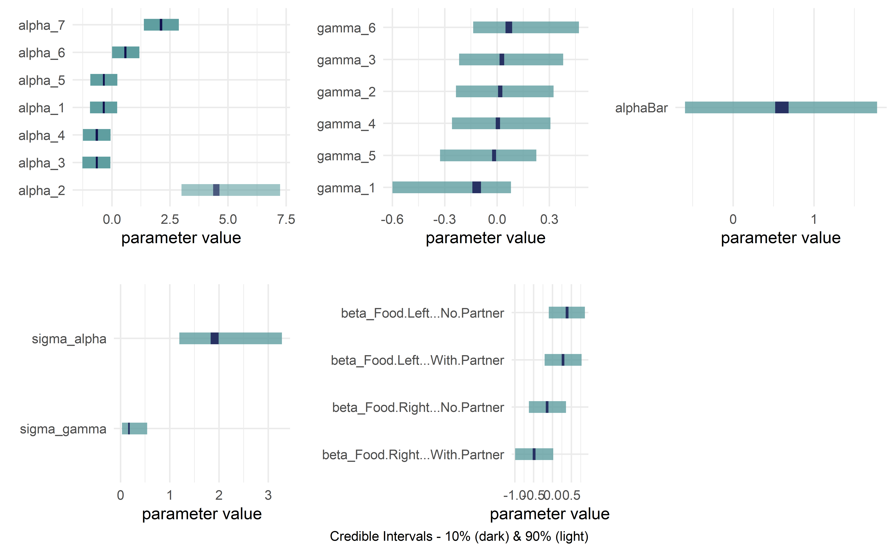

<!-- README.md is generated from README.Rmd. Please edit that file -->
<!-- badges: start -->

[](https://github.com/flyaflya/causact/actions)
[](https://cran.r-project.org/package=causact)
[](https://app.codecov.io/gh/flyaflya/causact?branch=master)
[](https://img.shields.io/badge/Lifecycle-Maturing-007EC6)
[](https://doi.org/10.5281/zenodo.6949489)
[](https://doi.org/10.21105/joss.04415)

<!-- badges: end -->

# causact

*Accelerate computational Bayesian inference workflows* in R through
interactive modelling, visualization, and inference. The package
leverages directed acyclic graphs (DAGs) to create a unified language
language for business stakeholders, statisticians, and programmers. Due
to its visual nature and simple model construction, `causact` serves as
a great entry-point for newcomers to computational Bayesian inference.

> The `causact` package offers robust support for both foundational and
> advanced Bayesian models. While introductory models are well-covered,
> the utilization of multi-variate distributions such as multi-variate
> normal, multi-nomial, or dirichlet distributions, may not work as
> expected. There are ongoing enhancements in the pipeline to facilitate
> construction of these more intricate models.


While proficiency in R is the only requirement for users of this
package, it also functions as a introductory probabilistic programming
language, seamlessly incorporating the `numpyro` Python package to
facilitate Bayesian inference without the need to learn any syntax
outside of the package or R. Furthermore, the package streamlines the
process of indexing categorical variables, which often presents a
complex syntax hurdle for those new to computational Bayesian methods.

For enhanced learning, the `causact` package for Bayesian inference is
featured in `A Business Analyst's Introduction to Business Analytics`
available at <https://www.causact.com/>.

> Feedback and encouragement is appreciated via github issues.

## Installation Guide

To install the `causact` package, follow the steps outlined below:

### CRAN Release Version (Recommended)

For the current stable release, which is tailored to integrate with
Python’s `numpyro` package, employ the following command:

``` r
install.packages("causact")
```

Then, see [Essential Dependencies](#essential-dependencies) if you want
to be able to automate sampling using the `numpyro` package.

### Development Release

If you want the most recent development version (not recommended),
execute the following:

``` r
install.packages("remotes")
remotes::install_github("flyaflya/causact")
```

### Essential Dependencies

To harness the full potential of `causact` for DAG visualization and
Bayesian posterior analysis, it’s vital to ensure proper integration
with the `numpyro` package. Given the Python-based nature of `numpyro`,
a few essential dependencies must be in place. Execute the following
commands after installing `causact`:

``` r
library(causact)
install_causact_deps()
```

If prompted, respond with `Y` to any inquiries related to installing
miniconda.

> **Note**: If opting for installation on Posit Cloud, temporarily
> adjust your project’s RAM to 4GB during the installation process
> (remember to APPLY CHANGES). This preemptive measure helps avoid
> encountering an
> `Error: Error creating conda environment [exit code 137]`. After
> installation, feel free to revert the settings to 1GB of RAM.

> **Note**: The September 11, 2023 release of `reticulate` (`v1.32`) has
> caused an issue which gives a
> `TypeError: the first argument must be callable` error when using
> `dag_numpyro()` on windows. If you experience this, install the dev
> version of `reticulate` by following the below steps:
>
> 1)  Install RTOOLS by using installer at:
>     <https://cran.r-project.org/bin/windows/Rtools/>
>
> 2)  Run this to get the dev version of `reticulate`:

    # install DEV version of reticulate
    # install.packages("pak") #uncomment as needed
    pak::pak("rstudio/reticulate")

### Retrograde Compatibility (Not Advised)

In cases where legacy compatibility is paramount and you still rely on
the operationality of the `dag_greta()` function, consider installing
`v0.4.2` of the `causact` package. However, it’s essential to emphasize
that this approach is **not recommended** for general usage:

``` r
### EXERCISE CAUTION BEFORE EXECUTING THESE LINES
### Only proceed if dag_greta() is integral to your existing codebase
install.packages("remotes")
remotes::install_github("flyaflya/causact@v0.4.2")
```

Your judicious choice of installation method will ensure a seamless and
effective integration of the `causact` package into your computational
toolkit.

## Usage

Example taken from
<https://www.causact.com/graphical-models-tell-joint-distribution-stories.html#graphical-models-tell-joint-distribution-stories>
with the packages `dag_foo()` functions further described here:

<https://www.causact.com/causact-quick-inference-with-generative-dags.html#causact-quick-inference-with-generative-dags>

### Create beautiful model visualizations.

    #> Initializing python, numpyro, and other dependencies. This may take up to 15 seconds...
    #> Initializing python, numpyro, and other dependencies. This may take up to 15 seconds...COMPLETED!
    #> 
    #> Attaching package: 'causact'
    #> The following objects are masked from 'package:stats':
    #> 
    #>     binomial, poisson
    #> The following objects are masked from 'package:base':
    #> 
    #>     beta, gamma

``` r
library(causact)
graph = dag_create() %>%
  dag_node(descr = "Get Card", label = "y",
           rhs = bernoulli(theta),
           data = carModelDF$getCard) %>%
  dag_node(descr = "Card Probability", label = "theta",
           rhs = beta(2,2),
           child = "y") %>%
  dag_plate(descr = "Car Model", label = "x",  
            data = carModelDF$carModel,  
            nodeLabels = "theta",  
            addDataNode = TRUE)  
graph %>% dag_render()
```


### Hide model complexity, as appropriate, from domain experts and other less statistically minded stakeholders.

``` r
graph %>% dag_render(shortLabel = TRUE)
```


### Get posterior while automatically running the underlying `numpyro` code

``` r
drawsDF = graph %>% dag_numpyro()
drawsDF  ### see top of data frame
#> # A tibble: 4,000 × 4
#>    theta_Toyota.Corolla theta_Subaru.Outback theta_Kia.Forte theta_Jeep.Wrangler
#>                   <dbl>                <dbl>           <dbl>               <dbl>
#>  1                0.196                0.617           0.293               0.853
#>  2                0.188                0.643           0.214               0.867
#>  3                0.182                0.641           0.215               0.862
#>  4                0.202                0.658           0.245               0.882
#>  5                0.191                0.652           0.293               0.854
#>  6                0.166                0.594           0.236               0.844
#>  7                0.214                0.626           0.230               0.843
#>  8                0.207                0.579           0.249               0.854
#>  9                0.189                0.601           0.271               0.831
#> 10                0.219                0.641           0.219               0.865
#> # ℹ 3,990 more rows
```

> **Note**: if you have used older versions of causact, please know that
> dag_numpyro() is a drop-in replacement for dag_greta().

### Get quick view of posterior distribution

``` r
drawsDF %>% dagp_plot()
```

<div class="figure">


<p class="caption">
Credible interval plots.
</p>

</div>

### OPTIONAL: See `numpyro` code without executing it (for debugging or learning)

``` r
numpyroCode = graph %>% dag_numpyro(mcmc = FALSE)
#> 
#> ## The below code will return a posterior distribution 
#> ## for the given DAG. Use dag_numpyro(mcmc=TRUE) to return a
#> ## data frame of the posterior distribution: 
#> reticulate::py_run_string("
#> import numpy as np
#> import numpyro as npo
#> import numpyro.distributions as dist
#> import pandas as pd
#> import arviz as az
#> from jax import random
#> from numpyro.infer import MCMC, NUTS
#> from jax.numpy import transpose as t
#> from jax.numpy import (exp, log, log1p, expm1, abs, mean,
#>                  sqrt, sign, round, concatenate, atleast_1d,
#>                  cos, sin, tan, cosh, sinh, tanh,
#>                  sum, prod, min, max, cumsum, cumprod )
#> ## note that above is from JAX numpy package, not numpy.
#> 
#> y = np.array(r.carModelDF.getCard)   #DATA
#> x      = pd.factorize(np.array(r.carModelDF.carModel),use_na_sentinel=True)[0]   #DIM
#> x_dim  = len(np.unique(x))   #DIM
#> x_crd  = pd.factorize(np.array(r.carModelDF.carModel),use_na_sentinel=True)[1]   #DIM
#> def graph_model(y,x):
#>  ## Define random variables and their relationships
#>  with npo.plate('x_dim',x_dim):
#>      theta = npo.sample('theta', dist.Beta(2,2))
#> 
#>  y = npo.sample('y', dist.Bernoulli(theta[x]),obs=y)
#> 
#> 
#> # computationally get posterior
#> mcmc = MCMC(NUTS(graph_model), num_warmup = 1000, num_samples = 4000)
#> rng_key = random.PRNGKey(seed = 1234567)
#> mcmc.run(rng_key,y,x)
#> drawsDS = az.from_numpyro(mcmc,
#>  coords = {'x_dim': x_crd},
#>  dims = {'theta': ['x_dim']}
#>  ).posterior
#> # prepare xarray dataset for export to R dataframe
#> dimensions_to_keep = ['chain','draw','x_dim']
#> drawsDS = drawsDS.squeeze(drop = True ).drop_dims([dim for dim in drawsDS.dims if dim not in dimensions_to_keep])
#> # unstack plate variables to flatten dataframe as needed
#> for x_da in drawsDS['x_dim']:
#>  new_varname = f'theta_{x_da.values}'
#>  drawsDS = drawsDS.assign(**{new_varname:drawsDS['theta'].sel(x_dim = x_da)})
#> drawsDS = drawsDS.drop_dims(['x_dim'])
#> drawsDF = drawsDS.squeeze().to_dataframe()"
#> ) ## END PYTHON STRING
#> drawsDF = reticulate::py$drawsDF
```

## Getting Help and Suggesting Improvements

Whether you encounter a clear bug, have a suggestion for improvement, or
just have a question, we are thrilled to help you out. In all cases,
please file a [GitHub
issue](https://github.com/flyaflya/causact/issues). If reporting a bug,
please include a minimal reproducible example.

## Contributing

We welcome help turning `causact` into the most intuitive and fastest
method of converting stakeholder narratives about data-generating
processes into actionable insight from posterior distributions. If you
want to help us achieve this vision, we welcome your contributions after
reading the [new contributor
guide](https://github.com/flyaflya/causact/blob/master/.github/contributing.md).
Please note that this project is released with a [Contributor Code of
Conduct](https://github.com/flyaflya/causact/blob/master/CODE_OF_CONDUCT.md).
By participating in this project you agree to abide by its terms.

## Further Usage

For more info, see
`A Business Analyst's Introduction to Business Analytics` available at
<https://www.causact.com>. You can also check out the package’s
vignette: `vignette("narrative-to-insight-with-causact")`. Two
additional examples are shown below.

## Prosocial Chimpanzees Example from Statistical Rethinking

> McElreath, Richard. Statistical rethinking: A Bayesian course with
> examples in R and Stan. Chapman and Hall/CRC, 2018.

``` r
library(tidyverse)
library(causact)

# data object used below, chimpanzeesDF, is built-in to causact package

graph = dag_create() %>%
  dag_node("Pull Left Handle","L",
           rhs = bernoulli(p),
           data = causact::chimpanzeesDF$pulled_left) %>%
  dag_node("Probability of Pull", "p",
           rhs = 1 / (1 + exp(-((alpha + gamma + beta)))),
           child = "L") %>%
  dag_node("Actor Intercept","alpha",
           rhs = normal(alphaBar, sigma_alpha),
           child = "p") %>%
  dag_node("Block Intercept","gamma",
           rhs = normal(0,sigma_gamma),
           child = "p") %>%
  dag_node("Treatment Intercept","beta",
           rhs = normal(0,0.5),
           child = "p") %>%
  dag_node("Actor Population Intercept","alphaBar",
           rhs = normal(0,1.5),
           child = "alpha") %>%
  dag_node("Actor Variation","sigma_alpha",
           rhs = exponential(1),
           child = "alpha") %>%
  dag_node("Block Variation","sigma_gamma",
           rhs = exponential(1),
           child = "gamma") %>%
  dag_plate("Observation","i",
            nodeLabels = c("L","p")) %>%
  dag_plate("Actor","act",
            nodeLabels = c("alpha"),
            data = chimpanzeesDF$actor,
            addDataNode = TRUE) %>%
  dag_plate("Block","blk",
            nodeLabels = c("gamma"),
            data = chimpanzeesDF$block,
            addDataNode = TRUE) %>%
  dag_plate("Treatment","trtmt",
            nodeLabels = c("beta"),
            data = chimpanzeesDF$treatment,
            addDataNode = TRUE)
```

### See graph

``` r
graph %>% dag_render(width = 2000, height = 800)
```


### Communicate with stakeholders for whom the statistics might be distracting

``` r
graph %>% dag_render(shortLabel = TRUE)
```


### Compute posterior

``` r
drawsDF = graph %>% dag_numpyro()
```

### Visualize posterior

``` r
drawsDF %>% dagp_plot()
```



## Eight Schools Example from Bayesian Data Analysis

> Gelman, Andrew, Hal S. Stern, John B. Carlin, David B. Dunson, Aki
> Vehtari, and Donald B. Rubin. Bayesian data analysis. Chapman and
> Hall/CRC, 2013.

``` r
library(tidyverse)
library(causact)

# data object used below, schoolDF, is built-in to causact package

graph = dag_create() %>%
  dag_node("Treatment Effect","y",
           rhs = normal(theta, sigma),
           data = causact::schoolsDF$y) %>%
  dag_node("Std Error of Effect Estimates","sigma",
           data = causact::schoolsDF$sigma,
           child = "y") %>%
  dag_node("Exp. Treatment Effect","theta",
           child = "y",
           rhs = avgEffect + schoolEffect) %>%
  dag_node("Pop Treatment Effect","avgEffect",
           child = "theta",
           rhs = normal(0,30)) %>%
  dag_node("School Level Effects","schoolEffect",
           rhs = normal(0,30),
           child = "theta") %>%
  dag_plate("Observation","i",nodeLabels = c("sigma","y","theta")) %>%
  dag_plate("School Name","school",
            nodeLabels = "schoolEffect",
            data = causact::schoolsDF$schoolName,
            addDataNode = TRUE)
```

### See graph

``` r
graph %>% dag_render()
```


### Compute posterior

``` r
drawsDF = graph %>% dag_numpyro()
```

### Visualize posterior

``` r
drawsDF %>% dagp_plot()
```


