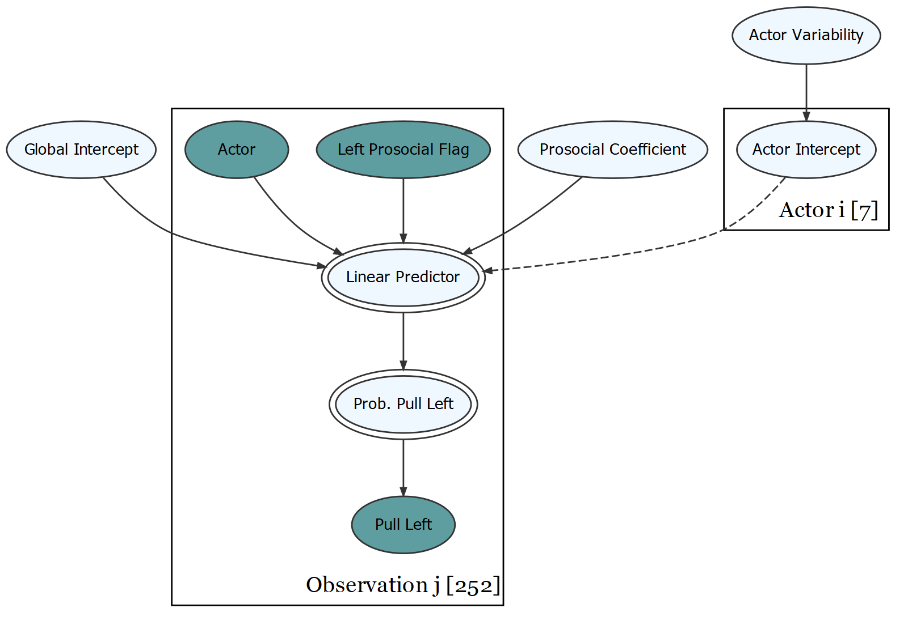
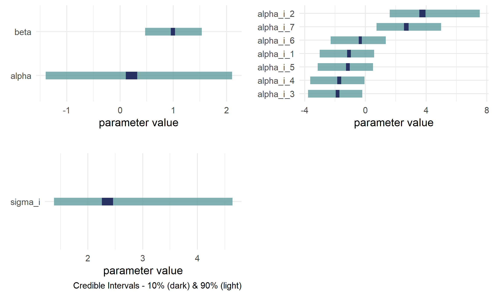

# Summary

The `causact` package provides `R` functions for visualizing and running inference on generative directed acyclic graphs (DAGs).  Once a generative DAG is created, the package automates Bayesian inference via the `greta` package [@golding2019greta] and `TensorFlow` [@dillon2017tensorflow].  The package eliminates the need for three separate versions of a model: 1) the narrative describing the problem, 2) the statistical model representing the problem, and 3) the code enabling inference written in a probabilistic programming language.  Instead, `causact` users create one unified model, a generative DAG, using a visual representation. 

# Statement of Need

Bayesian data analysis mixes data with domain knowledge to quantify uncertainty in unknown outcomes.  Its beautifully-simple theoretical underpinnings are deployed in three main steps [@gelman2013bayesian]:

- **Modelling:** Joint probability distributions are specified to encode domain knowledge about potential data generating processes.
- **Conditioning:** Bayes rule is used to reallocate plausibility among the potential data generating processes to be consistent with both the encoded domain knowledge and the observed data.  The conditioned model is known as the posterior distribution.
- **Validation:** Evidence is collected to see whether the specified model as well as the computational implementation of the model and conditioning process are to be trusted or not.

Algorithmic advances in the *conditioning* step of Bayesian data analysis have given rise to a new class of programming languages called probabilistic programming languages (PPLs).  Practical and complex statistical models which are analytically intractable can now be solved computationally using inference algorithms.  In particular, Markov Chain Monte Carlo (MCMC) algorithms [@gelfand1990sampling; @gilks1996strategies;@congdon2010applied] handle arbitrarily large and complex models via highly effective sampling processes that quickly detect high-probability areas of the underlying distribution [@neal1993probabilistic,@pfeffer2016practical,@kruschke2014doing].  

The `causact` package, presented in this paper, focuses on solving a three-language problem that occurs during Bayesian data analysis.  First, there is the language of the domain expert which we refer to as the _narrative_ of how data is generated.  Second, there is the language of _math_ where a statistical model, amenable to inference, is written.  Lastly, there is the language of _code_, where a PPL language supports computational inference from a well-defined statistical model.  The existence of these three languages creates friction as diverse stakeholders collaborate to yield insight from data; often mistakes get made in both communicating and translating between the three languages.  Prior to `causact`, any agreed upon narrative of a data-generating process must ultimately be modelled in code using an error-prone process where model misspecification, variable indexing errors, prior distribution omissions, and other mismatches between desired model and coded model go easily unnoticed.  

To unify inference-problem narratives, the statistical models representing those narratives, and the code implementing the statistical models, `causact` introduces a modified visualization of *directed acyclic graphs* (DAGs), called the *generative DAG*, to serve as a more intuitive and collaborative interface into probabilistic programming languages and to ensure faithful abstractions of real-world data generating processes.  

# Modelling with Generative DAGs

Generative DAGs pursue two simultaneous goals.  One goal is to capture the narrative by building a conceptual understanding of the data generating process that lends itself to statistical modelling.  And the second goal is to gather all the mathematical elements needed for specifying a complete Bayesian model of the data generating process.  Both of these goals will be satisfied by iteratively assessing the narrative and the narrative's translation into rigorous mathematics using `causact` functions.

Capturing the narrative in code uses some core `causact` functions like `dag_create()`, `dag_node()`, `dag_edge()`, and `dag_plate()` with the chaining operator `%>%` used to build a DAG from the individual elements.  `dag_render()` or `dag_greta()` are then used to visualize the DAG or run inference on the DAG, respectively.  The simplicity with which generative DAGs are constructed belies the complexity of models which can be supported.  For example, multi-level or hierarchical models are easily constructed as shown here in code for constructing and visualizing an experiment about chimpanzees [@mcelreath2020statistical] whose data is included in `causact` (`causact::chimpanzeesDF`).  Chimpanzees are given a choice to pull one of two levers - right or left.  Depending on the lever pulled, the chimpanzee is either prosocial, pulling the lever which feeds both himself and a partner, or not prosocial where only the lever-puller receives food.  

```r
## get only the experiments with partner present
chimpDF = causact::chimpanzeesDF %>% filter(condition == 1)
## create model
graph = dag_create() %>% 
  dag_node("Pull Left","L",
           rhs = bernoulli(theta),
           data = chimpDF$pulled_left) %>% 
  dag_node("Prob. Pull Left","theta",
           rhs = 1 / (1 + exp(-y)),
           child = "L") %>% 
  dag_node("Linear Predictor","y",
           rhs = alpha + alpha_i + beta * prosoc_left,
           child = "theta") %>% 
  dag_node("Global Intercept","alpha",
          rhs = normal(0,10)) %>%
  dag_node("Actor Intercept","alpha_i",
           rhs = normal(0,sigma_i)) %>% 
  dag_node("Prosocial Coefficient","beta",
           rhs = normal(0,10)) %>% 
  dag_node("Left Prosocial Flag","prosoc_left",
           data = chimpDF$prosoc_left) %>%
  dag_edge(c("alpha","alpha_i","beta","prosoc_left"),"y") %>% 
  dag_node("Actor Variability","sigma_i",
           rhs = cauchy(0,1,trunc = c(0,Inf)),
           child = "alpha_i") %>% 
  dag_plate("Actor","i",
            nodeLabels = c("alpha_i"),
            data = chimpDF$actor,
            addDataNode = TRUE) %>%
  dag_plate("Observation","j",
            nodeLabels = c("prosoc_left","i","y","theta","L"))
graph %>% dag_render()
```

<center>
{ width=98% }
</center>

\autoref{fig:chimpShort} replicates \autoref{fig:chimps} without math for less intimidating discussions with domain experts about the model using the `shortLabel = TRUE` argument (shown below).  `causact` does not require a complete model specification prior to rendering the DAG, hence, `causact` facilitates qualitative collaboration on the model design between less technical domain experts and the model builder.

```r
graph %>% dag_render(shortLabel = TRUE)
```

<center>
{ width=98% }
</center>

All visualizations, including \autoref{fig:chimps} and \autoref{fig:chimpShort}, are created via `causact`'s calls to the `DiagrammeR` package [@iannone20].  The `dag_diagrammer()` function can convert a `causact_graph` to a `dgr_graph` (the main object when using `DiagrammeR`) for further customizing of a visualization using the `DiagrammeR` package. 

Sampling from the posterior of the chimpanzee model (\autoref{fig:chimps}) does not require a user to write PPL code, but rather a user will simply pass the generative DAG object to `dag_greta()` and then inspect the data frame of posterior draws:

```r
library(greta) ## greta uses TensorFlow to get sample
drawsDF = graph %>% dag_greta()
drawsDF
```

```
## # A tibble: 4,000 x 10
##     alpha alpha_i_1 alpha_i_2 alpha_i_3 alpha_i_4 alpha_i_5 alpha_i_6
##     <dbl>     <dbl>     <dbl>     <dbl>     <dbl>     <dbl>     <dbl>
##  1  0.227    -1.01       3.58     -1.40    -1.50     -0.963    0.133 
##  2  0.227    -1.01       3.58     -1.40    -1.50     -0.963    0.133 
##  3 -0.204    -0.489      3.84     -1.43    -1.14     -0.253    0.863 
##  4  0.221    -0.503      3.83     -1.30    -0.835    -0.212    0.0866
##  5  0.189    -1.54       3.99     -1.27    -1.85     -1.60     0.0299
##  6  1.14     -1.58       2.20     -3.06    -2.58     -2.00    -1.41  
##  7 -0.195    -0.405      2.75     -1.53    -0.849    -0.750   -0.481 
##  8  0.832    -2.04       2.96     -3.12    -2.65     -1.67    -1.71  
##  9  1.91     -2.78       1.78     -3.98    -3.15     -2.97    -2.46  
## 10  1.01     -2.52       6.37     -2.74    -3.09     -2.37    -0.957 
## # ... with 3,990 more rows, and 3 more variables: alpha_i_7 <dbl>,
##   beta <dbl>, sigma_i <dbl>
```

Behind the scenes, `causact` creates the model's code equivalent using the `greta` PPL, but this is typically hidden from the user.  However, for debugging or further customizing a model, the `greta` code can be printed to the screen without executing it by setting the `mcmc` argument to `FALSE`:

```r
graph %>% dag_greta(mcmc=FALSE)
```

```
## prosoc_left <- as_data(chimpDF$prosoc_left)   #DATA
## L <- as_data(chimpDF$pulled_left)             #DATA
## i      <- as.factor(chimpDF$actor)   #DIM
## i_dim  <- length(unique(i))   #DIM
## alpha   <- normal(mean = 0, sd = 10)                            #PRIOR
## beta    <- normal(mean = 0, sd = 10)                            #PRIOR
## sigma_i <- cauchy(location = 0, scale = 1, trunc = c(0, Inf))   #PRIOR
## alpha_i <- normal(mean = 0, sd = sigma_i, dim = i_dim)          #PRIOR
## y      <- alpha + alpha_i[i] + beta * prosoc_left   #OPERATION
## theta  <- 1 / (1 + exp(-y))                         #OPERATION
## distribution(L) <- bernoulli(prob = theta)   #LIKELIHOOD
## gretaModel  <- model(alpha,alpha_i,beta,sigma_i)   #MODEL
## meaningfulLabels(graph)
## draws       <- mcmc(gretaModel)              #POSTERIOR
## drawsDF     <- replaceLabels(draws) %>% as.matrix() %>%
##                 dplyr::as_tibble()           #POSTERIOR
## tidyDrawsDF <- drawsDF %>% addPriorGroups()  #POSTERIOR
```

The produced `greta` code is shown in the above code snippet.  The code can be difficult to digest for some and exemplifies the advantages of working visually using `casuact`.  The above code is also challenging to write without error or misinterpretation.  Indexing is particularly tricky in PPL's and `causact` abbreviates posterior parameters using indexes consistent with the id data provided (e.g. `$as.factor(chimpDF$actor)$`).

The output of `dag_greta()` is in the form of a data frame of draws from the joint posterior.  To facilitate a quick look into posterior estimates, the `dagp_plot()` function creates a simple visual of 90% credible intervals.  It is the only core function that does not take a graph as its first argument.  By grouping all parameters that share the same prior distribution and leveraging the meaningful parameter names constructed using `dag_greta()`, it allows for quick comparisons of parameter values.

```r
drawsDF %>% dagp_plot()
```

<center>
  { width=78% }
</center>

The code above makes the plot in \autoref{fig:chimpPlot}.  For further posterior plotting, users would make their own plots using `ggplot2` [@wickham2016], `ggdist` [@kay2020], or similar.  For further model validation, including MCMC diagnostics, the user would use a package like `bayesplot` [@gabry2019visualization] or `shinystan` [@gabry2018].  For users who prefer to work with an `mcmc` object, they can extract the `draws` object after running the generated `greta` code from `dag_greta(mcmc=FALSE)` or find the object in the `cacheEnv` environment after running `dag_greta(mcmc=FALSE)` using `get("draws",envir = causact:::cacheEnv)`.  

# Comparison to Other Packages
\label{sec:compare}

By focusing on generative DAG creation as opposed to PPL code, `causact` liberates users from the need to learn complicated probabilistic programming languages. As such, it is similar in spirit to any package whose goal is to make Bayesian inference accessible without learning a PPL.  Perhaps the first such software was DoodleBUGS which provided a DAG-based graphical interface into WinBUGS[@lunn2000].  In terms of leveraging more modern PPLs, `causact` is similar to `brms` [@burkner2017brms], `rstanarm` [@goodrich], and `rethinking` [@mc20] - three `R` packages which leverage `Stan` [@stan_development_team] for Bayesian statistical inference with MCMC sampling.  Like the `rethinking` package which is tightly integrated with a textbook [@mcelreath2020statistical], a large motivation for developing `causact` was to make learning Bayesian inference easier. The package serves a central role in a textbook titled *A Business Analyst's Introduction to Business Analytics: Intro to Bayesian Business Analytics in the R Ecosystem.* [@fleischhacker2020business].  As a point of contrast, the DAGitty package [@textor2017] also focuses on DAG creation/visualization, but DAGitty's intent is to help ensure consistency between the causal assumptions of a researcher and the dataset to which those assumptions should apply; DAGitty does not create PPL code for automating inference.

# Conclusion

The causact modelling syntax is flexible and encourages modellers to make bespoke models.  The long-term plan for the `causact` package is to promote a Bayesian workflow that philosophically mimics the Principled Bayesian Workflow outlined by @betancourt2020b.  The structure of a generative DAG is sure to be much more transparent and interpretable than most other modern machine learning workflows; this is especially true when models are made accessible to those without statistical or coding expertise.  For this reason, generative DAGs can help facilitate effective communication between modelers and domain users both during the designing process of the models and when explaining the results returned by the models.

# Acknowledgements

The `Stan` Development team has been inspirational for this work and has formed a wonderful Bayesian inference community around their powerful language.  Additionally, the books of @kruschke2014doing and @mcelreath2020statistical are tremendous resources for learning Bayesian data analysis and their pedagogy is aspirational.  This work would not be possible without the `greta` dev team and special thanks to Nick Golding and Nick Tierney. Lastly, thanks to the University of Delaware students, MBAs and PhDs, who have contributed time, code, testing, and enthusiasm for this project from its beginning.

# References
