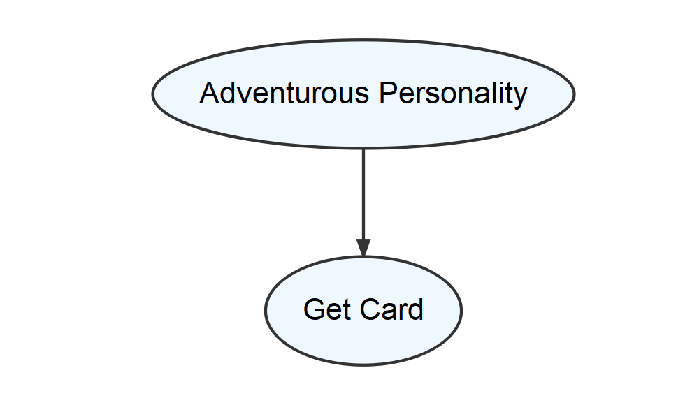
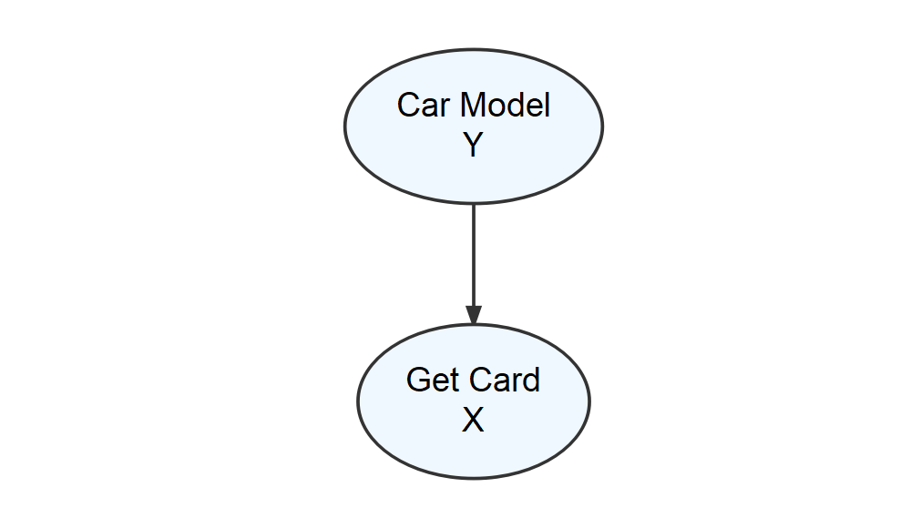
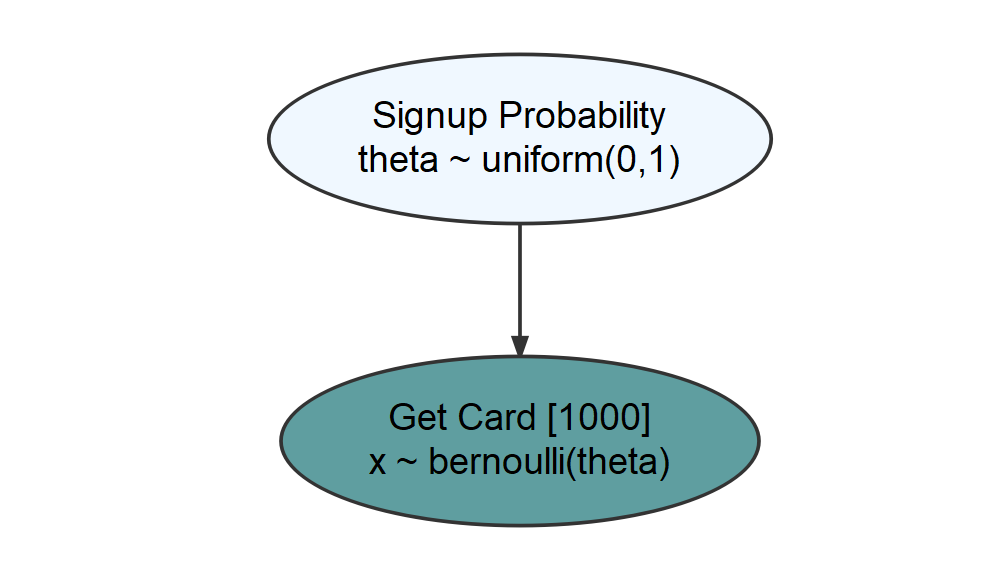
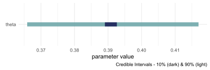
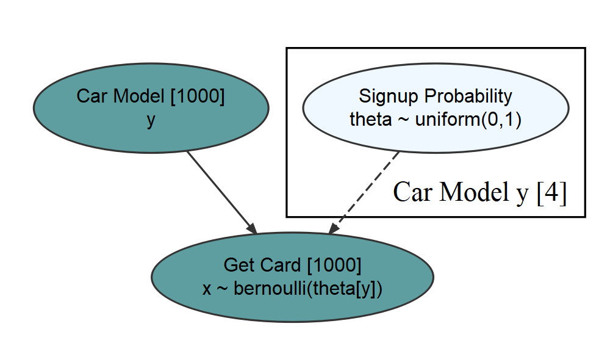
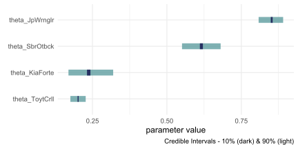
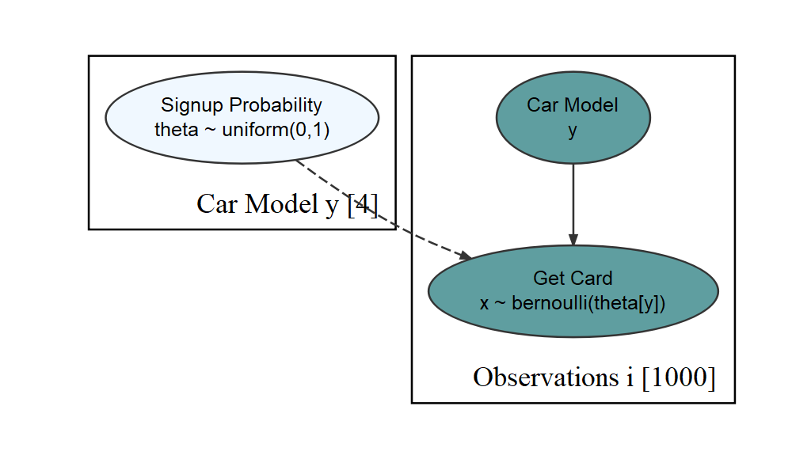

This vignette illustrates how to use the `causact` package to reduce the friction experienced while going from business issues to computational Bayesian models, inference, and insight.  The package is easy-to-use, intuitive, and provides a visual interface to `greta`, an `R` based probabilistic programming language (PPL).  To get started load the required packages:


```r
library(greta)
library(causact)
```

## Motivating Business Narrative

We will use the below example fictional narrative along with some simulated data to motivate how to use use `causact` for iterating from narrative to computational insight.  A more detailed version of this vignette can be found in Chapters 14-17 of "A Business Analyst's Introduction to Business Analytics" available at http://www.causact.com.

> BankPass is an auto financing company that is launching a new credit card, the Travel Rewards Card (TRC).  The card is designed for people who love to take adventure vacations like ziplining, kayaking, scuba diving, and the like.  To date, BankPass has been randomly selecting a small number of customers to target with a private offer to sign up for the card.  They would like to assess the probability that an individual will get a TRC card if exposed to a private marketing offer.  Since they are an auto-loan company, they are curious about whether the model of car (e.g. Honda Accord, Toyota Corrola, Jeep Wrangler, etc.) being financed influences a customer's willingness to sign up for the credit card.  The logic is that people who like adventure travel might also like specific kinds of cars.  If it is true that cars are a reflection of their owners, then the company might expand its credit card offerings to take advantage of its car ownership data.

### An Initial Step

Let's get started capturing the BankPass problem as a graphical model.  The first thought should be to make a simple model of how the real-world ends up generating your variable(s) of interest; and don't worry about how good the model is - just get something written.


```r
library(causact)
dag_create() %>%
  dag_node("Get Card", "Y") %>%
  dag_node("Adventurous Personality", "X",
           child = "Y") %>%
  dag_render(shortLabel = TRUE)
```



The above output is a visual depiction of what mathematicians and computer scientists call a _graph_.  To them, a _graph_ is a set of related objects where the objects are called _nodes_ and any pair of related nodes are known as an _edge_.  For our purposes, a _node_ is a visual depiction of a random variable (i.e. an oval) and the presence of a visible _edge_ indicates a relationship between the connected random variables.

### Ensuring Nodes Are RV's {#analysis-of-nodes}

Vetting the above model reveals some shortcomings and our first vetting criteria is to ensure the two nodes can be modelled as random variables with each node representing a mapping of real-world outcomes to a numerical values.

For the "Get Card" node, let's label it $X$, the mapping of outcomes to values is the conventional mapping for a Bernoulli-distributed random variable:

$$
X \equiv
\begin{cases}
  0, & \textrm{if customer does not get the card }\\
  1, & \textrm{if customer gets the TRC card }
\end{cases}
$$

where successes are mapped to 1 and failures mapped to 0.

However, how does one map "Adventurous Personality" to values?  In fact, what measurement or specific criteria am I using for "Adventurous Personality"?  This is an ill-defined variable.  Since the story actually suggests that _Car Model_ is the data we have, let's create a graphical model where _Car Model_ helps determine the likelihood of _Get Card_. Using $Y$ and $X$ as respective labels for _Car Model_ and _Get Card_, we show a revised candidate graphical model below.


```r
library(causact)
dag_create() %>%
  dag_node("Get Card", "X") %>%
  dag_node("Car Model", "Y",
           child = "X") %>%
  dag_render(shortLabel = FALSE)
```



As shown above, the difficult to measure personality node gets replaced by the car model node.  To verify we can measure _Car Model_ as a random variable, let's be explicit about the mapping of "Car Model" outcomes to real numbers.  For example:

$$
Y \equiv
\begin{cases}
  1, & \textrm{if customer owns a Toyota Corolla}\\
  2, & \textrm{if customer owns a Jeep Wrangler}\\
  \textrm{ } \vdots  & \hspace{3cm} \vdots\\
  K, & \textrm{if customer owns the } K^{th} \textrm{car model.}
\end{cases}
$$

### Adding data, likelihood, and prior

A dataset to accompany this story is built-in to the `causact` package:


```r
# ------------------------------------
# Revisiting the Get Credit Card Model
# ------------------------------------

# data included in the causact package
# 1,000 customers and the car they drive
carModelDF   #show data
#> # A tibble: 1,000 x 3
#> # Rowwise: 
#>    customerID carModel       getCard
#>         <int> <chr>            <int>
#>  1          1 Toyota Corolla       0
#>  2          2 Subaru Outback       1
#>  3          3 Toyota Corolla       0
#>  4          4 Subaru Outback       0
#>  5          5 Kia Forte            1
#>  6          6 Toyota Corolla       0
#>  7          7 Toyota Corolla       0
#>  8          8 Subaru Outback       1
#>  9          9 Toyota Corolla       0
#> 10         10 Toyota Corolla       0
#> # ... with 990 more rows
```

We take a bottom-up approach starting with our target measurement _Get Card_ to add in mathematical details about how the data is generated.  Specifically, we declare any observation `x` to be a Bernoulli-distributed random variable with yet-to-be-defined parameter `theta`.  (For a list of supported distributions type `?greta::distributions`)

To model additional nodes, consider any parameters on the right-hand side of the statistical model that remain undefined; in our case `theta` is undefined.  Hence, if $x \sim \textrm{Bernoulli}(\theta)$, then $\theta$ should be a parent node of $x$ in the graphical model.  And at this point, we say _ay caramba!_.  There is a mismatch between _Car Model_, the parent of _Get Card_ in the previous graphical model, and $\theta$, the implied parent of _Get Card_ using the statistical model.

Realizing that _Signup Probability_, $\theta$,  is truly the variable of interest as we are interested in modelling the probability of someone signing up for the card.  The below figure graphically models the _probability of sign-up_ ($\theta$) as the parent.  Notice that nodes with data, i.e.  _Get Card_, have darker fill; _observed nodes_ get a darker fill and _latent_ or _unobserved nodes_ remain lighter.  The right-hand side (`rhs`) of darker nodes represent the _likelihood_ part of Bayes rule and the right-hand side of lighter nodes reprent the _prior_ part of Bayes rule.


```r
graph = dag_create() %>%
  dag_node("Get Card","x",
           rhs = bernoulli(theta),
           data = carModelDF$getCard) %>%
  dag_node("Signup Probability","theta",
           rhs = uniform(0,1),
           child = "x")
graph %>% dag_render()
```



The above generative recipe implies there is only one _true_ $\theta$ value - which is unknown so we place a flat uniform prior over all possible values for $\theta$. Given $\theta$, 1,000 observations are outcomes of Bernoulli trials using that one $\theta$ value.  The posterior distribution reallocates plausibility among $\theta$ values to those most consistent with our prior and data.  A representative sample from the posterior distribution is easily obtained using `dag_greta`:


```r
drawsDF = graph %>% dag_greta()
drawsDF %>% dagp_plot()
```



From this, a reasonable conclusion might be that plausible values for _Signup Probability_ lie (roughly) between 37% and 42%.

### Modelling the effect of car model with plates

Our business narrative calls for the probability to change based on car model.  The `dag_plate()` function helps create a generative DAG where `theta` will vary based on car model.  A major difference between `greta` and `causact` is that the `causact` package shifts the burden of index creation to the computer.  A _plate_ signifies that the random variables inside of it should be repeated; thus, any oval inside a plate is indexed behind the scenes and effectively, a repeat instance is created for each member of the plate.  The system automatically adds the index to the model using the plate `label` for indexing notation. When using `dag_plate()` the following arguments prove most useful:

* `descr` - a character string representing a longer more descriptive label for the cluster/plate.
* `label` - a short character string to use as an index label when generating code.
* `data` - a vector representing the categorical data whose unique values become the plate index. When using with `addDataNode = TRUE`, ensure this vector represents observations of a variable whose unique values can be coerced to a factor.  Omit this argument and `causact` assumes that node replication is based on observations of any observed nodes within the plate.
* `nodeLabels` - a character vector of node labels or descriptions to include in the list of nodes that get repeated one time per index value.  Labels must be defined already within the specification of the `causact_graph_`.
* `addDataNode` - a logical value. When `addDataNode = TRUE`, the code adds a node of observed data, in addition to the plate, based on the supplied `data` argument value.  This node is used to extract the proper index when any of the nodes in the plate are fed to children nodes. Verify the graphical model using `dag_render()` to ensure correct behavior.

Below, we can change the generative DAG to accommodate the story of _Signup Probability_ being different for drivers of different cars.


```r
### Now vary your modelling of theta by car model
### we use the plate notation to say
### "create a copy of theta for each unique car model
graph = dag_create() %>%
  dag_node("Get Card","x",
           rhs = bernoulli(theta),
           data = carModelDF$getCard) %>%
  dag_node(descr = "Signup Probability",
           label = "theta",
           rhs = uniform(0,1),
           child = "x") %>%
  dag_plate(descr = "Car Model",
            label = "y",
            data = carModelDF$carModel, #plate labels
            nodeLabels = "theta",  # node on plate
            addDataNode = TRUE)  # create obs. node
graph %>% dag_render()
```



This generative DAG used one additional function call, `dag_plate()`, that resulted in both the creation of the plate, and also the additional node representing _Car Model_ observations.  Each of the 1,000 observed customers of the _Car Model_ __node__ were driving one of 4 unique car models of the _Car Model_ __plate__.  The indexing of `theta` by `y`, i.e. the `theta[y]` on the `rhs` of the _Get Card_ node extracts one of the 4 $\theta$-values to govern each observation of $x$.

> Expert tip: Observed-discrete random variables, like car model, are best modelled via plates.  Do not rush to add nodes or indexes for these random variables.  Let dag\_plate() do the work for you.

Now, when we get the posterior distribution from our `greta` code, we get a representative sample of four $\theta$ values instead of one.


```r
## get representative sample
drawsDF = graph %>% dag_greta(warmup = 400)
```

Visualizing the posterior yields:


```r
drawsDF %>% dagp_plot()
```



Notice, the index names for the four `theta` values are automatically generated as abbreviated versions of the unique labels found in `carModelDF$carModel`.

Digesting the psoterior plot, notice that credible interval widths are different for the different `theta` values.  For example, the probability interval for the Toyota Corolla is more narrow than the interval for the other cars.  This is simply because there is more data regarding Toyota Corolla drivers than the other vehicles.  With more data, we get more confident in our estimate. Here is a quick way to see the distribution of car models across our observations:


```r
library(tidyverse)
carModelDF %>%
  group_by(carModel) %>%
  summarize(numOfObservations = n())
#> # A tibble: 4 x 2
#>   carModel       numOfObservations
#>   <chr>                      <int>
#> 1 Jeep Wrangler                193
#> 2 Kia Forte                     86
#> 3 Subaru Outback               145
#> 4 Toyota Corolla               576
```

### Making A Probabilistic Statement With An Indicator Function

In the previous posterior plot, notice the overlapping beliefs regarding the _true_ sign-up probability for drivers of the Toyota Corolla and Kia Forte.  Based on this, a reasonable query might be what is the probability that `theta_KiaForte` > `theta_ToytCrll`? As a typical workflow, use an indicator function on the posterior draws to answer the question.  So, to answer "what is the probability that `theta_KiaForte` > `theta_ToytCrll`?", we compute:


```r
drawsDF %>%
  mutate(indicatorFunction =
           theta_KiaForte > theta_ToytCrll) %>%
  summarize(pctOfDraws = mean(indicatorFunction))
#> # A tibble: 1 x 1
#>   pctOfDraws
#>        <dbl>
#> 1      0.805
```


And using this ability to make probabalistic statements, one might say "there is an approximately 81% chance that Kia Forte drivers are more likely than Toyota Corolla drivers to sign up for the credit card.

## Putting A Plate Around The Observed Random Variables

In the previous genrative DAG, the bracketed `[1000]` next to the node descriptions tells us that the observed data has 1,000 elements. Often, for visual clarity, I like to make a plate of observations and have the observed nodes revert back to representing single realizations.  This is done by creating a second plate, but now excluding the `data` argument in the additional call to `dag_plate`:


```r
graph = dag_create() %>%
  dag_node("Get Card","x",
           rhs = bernoulli(theta),
           data = carModelDF$getCard) %>%
  dag_node("Signup Probability","theta",
           rhs = uniform(0,1),
           child = "x") %>%
  dag_plate("Car Model", "y",
            data = carModelDF$carModel,
            nodeLabels = "theta",
            addDataNode = TRUE)  %>%
  dag_plate("Observations", "i",
            nodeLabels = c("x","y"))
```

`dag_plate()` now infers the number of repetitions from the observed values within the plate.   The generative DAG shown below reflects this change, yet remains  computationally equivalent to the previous DAG.


```r
graph %>% dag_render()
```



This code change is completely optional, but using the extra plate adds clarity for both you and your collaborators in a data analysis.

## Getting Help

The `causact` package is actively being developed.  Please post any questions or bugs as a github issue at: https://github.com/flyaflya/causact/issues.
